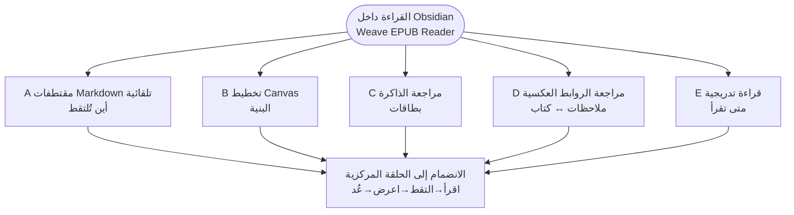
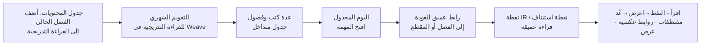

# Weave EPUB Reader

[中文](./README.zh-CN.md) | [繁體中文](./README.zh-TW.md) | [English](./README.md#english-documentation) | [Español](./README.es.md) | [Français](./README.fr.md) | [日本語](./README.ja.md) | [한국어](./README.ko.md) | [Русский](./README.ru.md) | [العربية](./README.ar.md)

---

## مقدمة

إذا كنت تريد أن يكون **Obsidian أكثر من أرشيف ملاحظات—مكانًا تقرأ فيه فعليًا**—فاستحق Weave EPUB Reader نظرة.

يناسب من يلتقط الجمل في Markdown أثناء القراءة؛ والباحثين الذين ينظّمون المقتطفات على Canvas؛ ومستخدمي Weave الذين يحوّلون الفقرات إلى بطاقات تكرار متباعد؛ ومن يدير عدة كتب في آنٍ ويُفضّل إيقاع تقويم شهري على «عشرة كتب مفتوحة ونصف صفحة في كل منها».

البداية خفيفة: ضع ملف EPUB في الـ vault، وافتحه من رف الكتب، وحدد نصًا وأنشئ مقتطفًا. كل التقاط يحتفظ برابط إلى الموضع نفسه في الكتاب؛ وعند تعديل الملاحظات أو حذفها أو تغيير لونها تتحدّث التظليلات في النص وفقًا لذلك. خمسة مسارات أوفى—المقتطفات التلقائية وCanvas والبطاقات والروابط العكسية والقراءة التدريجية—موضّحة في [سير عمل المقتطفات والملاحظات](#سير-عمل-المقتطفات-والملاحظات) أدناه؛ اتبع ما يناسب عادتك.

## قائمة الميزات الأساسية

### القراءة ورف الكتب

- قراءة على كل المنصات: سطح المكتب والجوال
- قراءة EPUB وTXT وFB2/FBZ وMOBI وAZW3 وCBZ وPDF
- رف كتبي: استيراد، أغلفة، تقدّم، بحث/تصفية، حالة القراءة
- تصفّح بالصفحات / تمرير مستمر، عمود واحد / عمودان، وضوابط العرض والطباعة
- تقدّم قراءة دائم، إشارات مرجعية، تقدير الوقت المتبقي
- نقاط قراءة مرجعية (تسجيل / تحديث / انتقال)
- تدرج الإضاءة أثناء القراءة العادية (Premium)
- وضع قراءة الفقرات، ملء الشاشة الغامر (Premium)
- قوائم تشغيل رف الكتب (Premium)

### المقتطفات والتعليقات

- خمسة ألوان تظليل مع تسطير / شطب / تسطير متموّج
- فقاعات أفكار (`---div---`)
- الوضع التلقائي: إدراج في الملاحظات / نسخ إلى الحافظة
- عرض داخل النص ومزامنة لـ Markdown / Canvas / مجموعات Weave
- مقتطفات لقطة الشاشة (يمكن أن تمتد عبر الصفحات)

### ملخصات المقتطفات

- قائمة بطاقات المقتطفات (تصفية، ترتيب، الانتقال إلى المصدر)
- عرض الخط الزمني للمقتطفات (مراجعة حسب التاريخ، الانتقال إلى المصدر؛ Premium)
- تحديد دفعي: تصدير / حذف
- شريط كثافة خريطة الكتاب في الشريط الجانبي لجدول المحتويات (Premium)
- علامات الفصول في جدول المحتويات (مهم / سؤال / مُتقَن؛ Premium)

### التتبّع والتكاملات

- روابط عميقة للكتاب تُكتب في المقتطفات
- تتبّع ثنائي الاتجاه دقيق: الملاحظات ↔ الكتاب (Premium)
- ربط Canvas وإنشاء العقد تلقائيًا والعرض
- صنع البطاقات / القراءة التدريجية / الذكاء الاصطناعي (يتطلب Weave؛ لا يستهلك ترخيص Premium للقارئ)

### التصدير والمساعدات

- تصدير الفصل الحالي إلى Markdown (Essential)
- تصدير مقتطفات الكتاب كاملًا / الفصل والفصول المعلَّمة (Premium)
- استوديو قوالب التصدير مع إعدادات مسبقة مدمجة
- معاينة الحواشي عند التمرير (Premium)
- واجهة متعددة اللغات (简体中文، 繁體中文، English، 日本語، 한국어، Русский، Deutsch، Español، العربية) + دليل داخل التطبيق

راجع [تجربة Essential ودعم Premium](#تجربة-essential-ودعم-premium) لكيفية تجميع القدرات.

أدنى إصدار لـ Obsidian: **1.8.7**

## سير عمل المقتطفات والملاحظات

تلخّص المخططات أدناه البنية (Mermaid يُعرض على **GitHub** وفي **Obsidian**).

### مخطط 1 · اختيار سير عمل (خريطة حسب الهدف)

القراءة داخل Obsidian هي المركز؛ وكل فرع مسار نموذجي حسب الهدف.

### مخطط 2 · مسار فرعي للقراءة التدريجية (السير E)

يجيب عن **كيف تتقدّم عدة كتب وفق جدول** ويكمل المقتطفات التلقائية (السير A): **E يجدول الفصول؛ وA يلتقط ما دوّنته**.

### خمسة مسارات نموذجية

#### A. مقتطفات Markdown تلقائية (الأكثر شيوعًا)

الأنسب عندما تكون **الملاحظات مساحة عملك الأساسية أثناء القراءة**:

1. **أولًا**، افتح ملاحظة Markdown كدفتر مقتطفات وضع المؤشر حيث يجب الإدراج (العرض المقسوم يعمل أفضل).
2. افتح القارئ وفعّل **الوضع التلقائي** في شريط الأدوات (أيقونة البرق: مفعّل = إدراج، معطّل = نسخ إلى الحافظة).
3. حدد نصًا في الكتاب وأنشئ مقتطفًا ← يُدرج كتلة مقتطف موضعي (مع رابط عميق للكتاب) **عند ذلك المؤشر**.
4. بعد حفظ الملاحظة، أعد فتح الكتاب: تظهر المقاطع المطابقة **تظليلات في النص**—ما التقطته في الملاحظات يظهر في الكتاب.

راجع [السير A](#a-مقتطفات-markdown-تلقائية-الأكثر-شيوعًا) أعلاه.

#### B. تخطيط بصري على Canvas

الأنسب لـ **الموضوعات والبنية والعلاقات**:

1. **اربط** ملف Canvas بالكتاب الحالي.
2. مع تفعيل الوضع التلقائي، يمكن للمقتطفات أن **تنشئ عقد Canvas تلقائيًا** (اتجاه التخطيط قابل للضبط).
3. رتّب العقد في Canvas؛ ويعيد القارئ **عرض المقتطفات المرتبطة في الكتاب**.

#### C. مراجعة الذاكرة

الأنسب عندما يجب أن تدخل المقتطفات في **تكرار متباعد**:

1. حدد نصًا ← **إنشاء بطاقة** في شريط الأدوات ← محرّر بطاقات Weave.
2. احفظ في `.wdeck` أو ملفات مجموعات أخرى؛ ويعرض القارئ **تظليلات من بيانات المجموعة**.
3. راجع في Weave؛ وعد إلى الكتاب عندما تحتاج المقطع الأصلي.

#### D. مراجعة الروابط العكسية

الأنسب لـ **الاقتباس أولًا، ثم المراجعة، ثم العودة إلى المصدر**:

1. راجع مقتطفات سابقة في Markdown / Canvas / المجموعات؛ وأعد فتح الكتاب لرؤية **التظليلات في النص**.
2. انقر رابطًا عميقًا للكتاب في ملاحظة ← انتقل إلى **المقطع الأصلي**.
3. انقر تظليلًا في القارئ ← **افتح ملاحظة المصدر** (تتبّع ثنائي الاتجاه).

#### E. القراءة التدريجية: قراءة عميقة متداخلة لعدة كتب

الأنسب عندما تريد أن **تتقدّم عدة كتب بإيقاع** بدل قراءة كتاب واحد من الغلاف إلى الغلاف دفعة واحدة:

1. **أضف الفصل الحالي إلى القراءة التدريجية**: في **جدول المحتويات** بالشريط الجانبي للقارئ، استخدم **إضافة إلى القراءة التدريجية** على فصل (واختر اختياريًا موضوع قراءة تدريجية) لإدراجه في الطابور.
2. **جدول في التقويم الشهري**: يظهر الفصل في **التقويم الشهري للقراءة التدريجية** في Weave إلى جانب نقاط قراءة من كتب وفصول أخرى—**قراءة متداخلة لعدة كتب** بدل ترك كثير من الكتب نصف مفتوحة على الرف.
3. **قراءة عميقة لا سطحية**:  
   - حدد نصًا ← أنشئ **نقطة قراءة تدريجية** (تحتفظ برابط عميق لمصدر EPUB) للمتابعة على مستوى الفقرة؛  
   - أثناء القراءة، ضع **نقطة استئناف للقراءة التدريجية** ليعود جلسة IR التالية إلى **الموضع الدقيق** في الكتاب.  
4. في اليوم المجدول، افتح العنصر من التقويم أو قائمة المهام ← اتبع الرابط العميق إلى الفصل أو المقطع، ثم واصل المقتطفات والروابط العكسية.

هذا يكمّل السير A: **A هو أين تذهب الالتقاطات؛ وE هو متى يُقرأ كل فصل عبر عدة كتب.**

### مقارنة مع «قارئ خارجي + لصق يدوي»

- **انتقالات سياق أقل**—لا تغادر Obsidian لالتقاط جملة.
- **تصبح المقتطفات معرفة دائمة في الـ vault**—قابلة للبحث في Markdown أو Canvas أو المجموعات—لا في سجل الحافظة.
- **المراجعة تُبقي المصدر مرئيًا**—الملاحظات تفهرس ما قرأت؛ والكتاب يعرض السياق الحي عبر الروابط العميقة والعرض.
- **نفس السير عبر الأجهزة**—الكتب والملاحظات تعيش في الـ vault وتتبع إعداد مزامنة Obsidian لديك.
- **إيقاع للكتب الطويلة أو المتعددة**—تدخل الفصول تقويم القراءة التدريجية لتقدّم مجدول ومتداخل.

المزيد من التفاصيل: [سير عمل المقتطفات والملاحظات](#سير-عمل-المقتطفات-والملاحظات) و[قائمة الميزات الأساسية](#قائمة-الميزات-الأساسية) أعلاه.

## تجربة Essential ودعم Premium

| القدرة | تجربة Essential | دعم Premium |
|--------|:---------------:|:-----------:|
| **كل المنصات** (سطح المكتب والجوال) | ✅ | ✅ |
| قراءة **EPUB** وجدول المحتويات وأوضاع الصفحات/التمرير والطباعة والسمات | ✅ | ✅ |
| قراءة كتب نص عادي **TXT** | ✅ | ✅ |
| قراءة **FB2 / FBZ** | ✅ | ✅ |
| قراءة **MOBI / AZW3 / CBZ** | ✅ | ✅ |
| **خمسة ألوان تظليل** وتعليقات ومقتطفات و**عرض داخل النص** | ✅ | ✅ |
| أنماط **تسطير / شطب / تسطير متموّج** | ✅ | ✅ |
| عرض **قائمة البطاقات** للمقتطفات | ✅ | ✅ |
| عرض **الخط الزمني** للمقتطفات | 🔒 | ✅ |
| **شريط كثافة خريطة الكتاب** في الشريط الجانبي لجدول المحتويات | 🔒 | ✅ |
| **علامات الفصول** في جدول المحتويات (مهم / سؤال / مُتقَن) | 🔒 | ✅ |
| **قوائم تشغيل** رف الكتب | 🔒 | ✅ |
| **تتبّع ثنائي الاتجاه** (قفزات مرساة، القارئ ↔ الملاحظات / Canvas / المجموعات) | 🔒 | ✅ |
| **نقاط قراءة مرجعية** (تسجيل / تحديث / انتقال) | ✅ | ✅ |
| **تدرج الإضاءة أثناء القراءة العادية** | 🔒 | ✅ |
| **وضع قراءة الفقرات** وملء الشاشة الغامر | 🔒 | ✅ |
| **تقدّم القراءة** وتقدّم رف الكتب وآخر موضع وتقدير الوقت المتبقي | ✅ | ✅ |
| **إشارات مرجعية للصفحة الحالية** ومجلد الإشارات والتنقّل في قائمة الإشارات | ✅ | ✅ |
| ربط **Canvas** وإنشاء العقد تلقائيًا | ✅ | ✅ |
| معاينة الحواشي عند التمرير | 🔒 | ✅ |
| تصدير الفصل الحالي إلى Markdown | ✅ | ✅ |

> المفتاح: ✅ مضمَّن · 🔒 يتطلب دعم Premium

- **تفعيل دعم Premium**: ترخيص EPUB فقط في إعدادات القارئ، أو الوراثة من إضافة **Weave** الرئيسية المفعَّلة.
- **صنع البطاقات / القراءة التدريجية / الذكاء الاصطناعي**: لا تشغل فتحة ترخيص Premium منفصلة لـ EPUB، لكنها تتطلب Weave؛ والذكاء الاصطناعي يحتاج أيضًا مفتاح API خاصًا بك.

التقسيم الرسمي: [تجربة Essential ودعم Premium](#تجربة-essential-ودعم-premium) أعلاه. فعّل في إعدادات القارئ. الشروط: [PREMIUM_TERMS.md](./PREMIUM_TERMS.md).

## التثبيت

### الخيار 1: إضافات المجتمع (موصى به)

1. افتح **الإعدادات ← إضافات المجتمع ← تصفّح**
2. ابحث عن **Weave EPUB Reader** وثبّتها وفعّلها

### الخيار 2: تثبيت يدوي

1. نزّل [إصدار GitHub](https://github.com/zhuzhige123/obsidian-weave-reader/releases) المطابق لإصدار `manifest.json`:
   - `main.js`
   - `manifest.json`
   - `styles.css`
2. انسخها إلى `.obsidian/plugins/weave-epub-reader/`
3. أعد تشغيل Obsidian وفعّل **Weave EPUB Reader** ضمن **الإعدادات ← إضافات المجتمع**

## بداية سريعة

1. افتح **رف الكتب** من الشريط أو لوحة الأوامر؛ ثم استورد أو افتح كتابًا من الـ vault.
2. أنشئ أو افتح ملف Markdown وضع المؤشر حيث يجب أن تذهب المقتطفات؛ فعّل **المقتطف التلقائي** في القارئ. حدد نصًا لإنشاء تظليلات أو مقتطفات أو إشارات مرجعية—تُدرج عند ذلك المؤشر.
3. انقر تظليلًا في الكتاب للانتقال إلى ملاحظة المصدر من شريط الأدوات؛ وفي Markdown / Canvas الذي يحفظ المقتطف، انقر أيقونة الكتاب بجانبه للعودة إلى المقطع المطابق.
4. قائمة القارئ ← **مساعدة** ← **الدليل** للإرشاد داخل التطبيق. لتفاصيل المسارات، راجع [سير عمل المقتطفات والملاحظات](#سير-عمل-المقتطفات-والملاحظات) أعلاه.

## البيانات والمزامنة

**يُفضَّل مزامنته (في الـ vault)**: ملفات الكتب ومقتطفات Markdown وملفات Canvas وبيانات مجموعات Weave وملاحظات التقدّم/الإشارات لكل كتاب (الافتراضي `Weave EPUB Reader/data_*.md`).

**عادةً محلي (مجلد الإضافة)**: ذاكرة التخزين المؤقت للقارئ والفهارس وارتباطات Canvas ونقاط القراءة المرجعية وحالة محلية مشابهة. فضّل مزامنة محتوى الـ vault عبر الأجهزة بدل ملفات التخزين المؤقت تحت `.obsidian/plugins/weave-epub-reader/`.

## الخصوصية والشبكة

- القراءة والعرض والاقتباس والروابط العكسية **محلية افتراضيًا**؛ ولا يُرفع محتوى الـ vault بشكل استباقي.
- ميزات رف الكتب والروابط العكسية وتحديد المصدر تعدّد مسارات ملفات الـ vault محليًا؛ ونسخ المقتطفات أو رموز التفعيل يستخدم الحافظة. راجع [PRIVACY.md](./PRIVACY.md).
- **تفعيل دعم Premium** قد يتصل بخدمة التراخيص (رمز التفعيل، البريد، ملخص بصمة الجهاز، إلخ). راجع [PRIVACY.md](./PRIVACY.md).
- **ميزات الذكاء الاصطناعي** تستدعي خدمات الطرف الثالث التي تضبطها.

## الأسئلة الشائعة

### كيف ألتقط مقتطفات القراءة بشكل صحيح؟

تُخزَّن المقتطفات في مواقع محددة داخل ملفات Markdown أو Canvas أو مجموعات Weave التي تختارها. يجمع القارئ روابط المصدر من تلك الالتقاطات ويعرض التظليلات في الكتاب. التحديدات التي لا تُحفظ بهذه الطريقة تومض لحظيًا ولا تترك بيانات دائمة. لافتة الدليل داخل القارئ تشرح ذلك بمزيد من التفصيل.

### ما علاقة هذا بـ Weave؟

**يعمل Weave EPUB Reader بمفرده**: بدون إضافة [Weave](https://github.com/zhuzhige123/anki-obsidian-plugin) الرئيسية، يمكنك قراءة EPUB واستخدام رف الكتب والتقاط المقتطفات مع العرض داخل النص. مع تثبيت Weave يمكنك أيضًا ربط بطاقات التكرار المتباعد وتقويم القراءة التدريجية وإجراءات الذكاء الاصطناعي، ووراثة ترخيص Weave لدعم Premium. هما **رفيقان اختياريان** وليسا اعتمادًا إلزاميًا.

### هل يمكن مزامنة المقتطفات والملاحظات عبر المنصات؟

**نعم.** الالتقاطات تعيش في Markdown وCanvas وملفات المجموعات ومحتوى الـ vault الآخر، فتتبع مزامنة Obsidian التي تستخدمها أصلًا (Obsidian Sync أو iCloud أو vaults مزامَنة سحابيًا، إلخ) بين سطح المكتب والجوال. زامن محتوى الـ vault؛ وذاكرة التخزين المؤقت للقارئ تحت مجلد الإضافة عادةً لا تحتاج مزامنة عبر الأجهزة (راجع [البيانات والمزامنة](#البيانات-والمزامنة) أعلاه).

### هل يمكنني تصدير ملاحظاتي؟

**نعم.** بيانات المقتطفات والتظليل تبقى في الـ vault—يمكنك قراءة Markdown وتعديله وتصديره في Obsidian، ويوفّر القارئ تصدير الفصول وأدوات ذات صلة. **البيانات محلية افتراضيًا**؛ ولا يُرفع الـ vault بشكل استباقي.

### لماذا دعم Premium مدفوع؟

دعم Premium **يموّل التطوير المستمر** حتى يستمر تحسين القارئ وسير عمل المقتطفات. **تجربة Essential مجانية**—القراءة اليومية وخمسة ألوان تظليل والتعليقات والمقتطفات والعرض داخل النص قابلة للاستخدام بالكامل دون دفع. فعّل دعم Premium فقط عندما تريد الخط الزمني للمقتطفات والتتبّع الثنائي الاتجاه ووضع قراءة الفقرات وقدرات متقدمة أخرى.

### اشتراك أم شراء لمرة واحدة؟

دعم Premium هو **شراء لمرة واحدة** (فعّل مرة واستخدم طويلًا؛ راجع [شروط دعم Premium](./PREMIUM_TERMS.md))، وليس اشتراكًا شهريًا.

### لا أستطيع فتح صيغ غير EPUB؟

**EPUB وTXT وFB2/FBZ وMOBI وAZW3 وCBZ وPDF** ضمن تجربة Essential. راجع [تجربة Essential ودعم Premium](#تجربة-essential-ودعم-premium) أعلاه.

### اسم مجلد الإضافة؟

معرّف الإضافة: `weave-epub-reader` ← `.obsidian/plugins/weave-epub-reader/`

## مزيد من الوثائق

- [مقدمة (الصينية المبسطة)](./README.md#中文文档)
- [مقدمة (الصينية التقليدية)](./README.zh-TW.md)
- [Español](./README.es.md) · [Français](./README.fr.md) · [العربية](./README.ar.md)
- [الخصوصية](./PRIVACY.md) · [شروط دعم Premium](./PREMIUM_TERMS.md) · [الدعم](./SUPPORT.md) · [الأمان](./SECURITY.md)

## الترخيص والمؤلف

يُنشر الكود المصدري بموجب [GPL-3.0-or-later](LICENSE).

- Author: Rabbit (zhuzhige)
- GitHub: https://github.com/zhuzhige123
