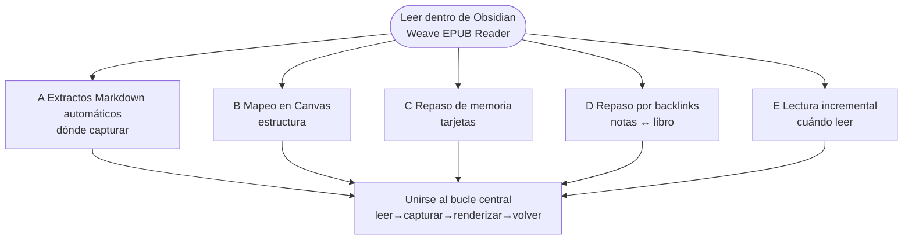
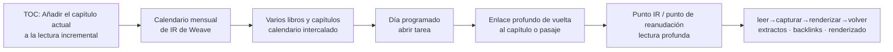

# Weave EPUB Reader

[中文](./README.zh-CN.md) | [繁體中文](./README.zh-TW.md) | [English](./README.md#english-documentation) | [Español](./README.es.md) | [Français](./README.fr.md) | [日本語](./README.ja.md) | [한국어](./README.ko.md) | [Русский](./README.ru.md) | [العربية](./README.ar.md)

---

## Introducción

Si quieres que **Obsidian sea más que un archivo de notas—un lugar donde realmente lees**—Weave EPUB Reader merece una mirada.

Encaja con quien captura frases en Markdown mientras lee; con investigadores que organizan extractos en Canvas; con usuarios de Weave que convierten pasajes en tarjetas de repetición espaciada; y con quien lleva varios libros a la vez y prefiere un ritmo de calendario mensual frente a «diez libros abiertos, media página en cada uno».

Empezar es sencillo: coloca un EPUB en tu vault, ábrelo desde la estantería, selecciona texto y crea un extracto. Cada captura conserva un enlace a ese mismo pasaje en el libro; al editar, eliminar o cambiar el color de las notas, los resaltados del texto se actualizan a la par. Cinco caminos más completos—extractos automáticos, Canvas, tarjetas, backlinks y lectura incremental—están diagramados en [Flujos de extractos y notas](#flujos-de-extractos-y-notas) más abajo; elige el que encaje con tu hábito.

## Lista de funciones principales

### Lectura y estantería

- Lectura en todas las plataformas: escritorio y móvil
- Lectura de EPUB, TXT y FB2/FBZ (MOBI, AZW3 y CBZ son Premium)
- Mi estantería: importar, portadas, progreso, búsqueda/filtro, estado de lectura
- Paginado / desplazamiento continuo, una / dos columnas, controles de ancho y tipografía
- Progreso de lectura persistente, marcadores, estimación de tiempo restante
- Modo de lectura por párrafos, pantalla completa inmersiva, puntos de lectura de referencia (Premium)
- Listas de reproducción de la estantería (Premium)

### Extractos y anotaciones

- Cinco colores de resaltado más subrayado / tachado / subrayado ondulado
- Burbujas de pensamiento (`---div---`)
- Modo automático: insertar en notas / copiar al portapapeles
- Renderizado en el cuerpo y sincronización para Markdown / Canvas / mazos Weave
- Extractos por captura de pantalla (pueden continuar entre páginas)

### Resúmenes de extractos

- Lista de tarjetas de extractos (filtrar, ordenar, saltar a la fuente)
- Vista de línea de tiempo de extractos (revisar por fecha, saltar a la fuente)
- Selección por lotes: exportar / eliminar
- Barra de densidad del mapa del libro en la barra lateral del TOC

### Trazado e integraciones

- Enlaces profundos al libro escritos en los extractos
- Trazado bidireccional preciso: notas ↔ libro (Premium)
- Vinculación con Canvas, creación automática de nodos y renderizado
- Creación de tarjetas / lectura incremental / IA (requiere Weave; no consume la licencia Premium del lector)

### Exportación y ayudas

- Exportar el capítulo actual a Markdown (Essential)
- Exportar extractos de todo el libro / del capítulo y capítulos marcados (Premium)
- Estudio de plantillas de exportación con presets integrados
- Vista previa de notas al pie al pasar el cursor (Premium)
- Interfaz multilingüe (简体中文、繁體中文、English、日本語、한국어、Русский、Deutsch、Español、العربية) + tutorial en la app

Consulta [Experiencia Essential y soporte Premium](#experiencia-essential-y-soporte-premium) para ver cómo se agrupan las capacidades.

Versión mínima de Obsidian: **1.8.7**

## Flujos de extractos y notas

Los diagramas siguientes resumen la estructura (Mermaid se renderiza en **GitHub** y en **Obsidian**).

### Diagrama 1 · Elegir un flujo (mapa por objetivo)

Leer dentro de Obsidian es el centro; cada rama es un camino típico según el objetivo.

### Diagrama 2 · Subflujo de lectura incremental (flujo E)

Responde **cómo avanzan varios libros con un calendario** y complementa los extractos automáticos (flujo A): **E programa capítulos; A captura lo que anotaste**.

### Cinco flujos típicos

#### A. Extractos Markdown automáticos (el más habitual)

Ideal cuando **las notas son tu espacio principal mientras lees**:

1. **Primero**, abre una nota Markdown como cuaderno de extractos y coloca el cursor donde deben insertarse (la vista dividida funciona mejor).
2. Abre el lector y activa el **modo automático** en la barra de herramientas (icono de rayo: activado = insertar, desactivado = copiar al portapapeles).
3. Selecciona texto en el libro y crea un extracto → un bloque de extracto localizado (con enlace profundo al libro) se **inserta en ese cursor**.
4. Tras guardar la nota, vuelve a abrir el libro: los pasajes coincidentes muestran **resaltados en el cuerpo**—lo que capturaste en las notas es visible en el libro.

Consulta el [flujo A](#a-extractos-markdown-automáticos-el-más-habitual) más arriba.

#### B. Mapeo visual en Canvas

Ideal para **temas, estructura y relaciones**:

1. **Vincula** un archivo Canvas al libro actual.
2. Con el modo automático activado, los extractos pueden **crear nodos de Canvas automáticamente** (la dirección del diseño es configurable).
3. Organiza los nodos en el Canvas; el lector **vuelve a renderizar los extractos relacionados en el libro**.

#### C. Repaso de memoria

Ideal cuando los extractos deben entrar en **repetición espaciada**:

1. Selecciona texto → **Crear tarjeta** en la barra de herramientas → editor de tarjetas de Weave.
2. Guarda en `.wdeck` u otros archivos de mazo; el lector **renderiza resaltados a partir de los datos del mazo**.
3. Repasa en Weave; salta al libro cuando necesites el pasaje original.

#### D. Repaso por backlinks

Ideal para **extraer primero, repasar después, volver a la fuente**:

1. Revisa extractos anteriores en Markdown / Canvas / mazos; vuelve a abrir el libro para ver **resaltados en el cuerpo**.
2. Haz clic en un enlace profundo al libro en una nota → salta al **pasaje original**.
3. Haz clic en un resaltado en el lector → **abre la nota de origen** (trazado bidireccional).

#### E. Lectura incremental: lectura profunda intercalada de varios libros

Ideal cuando quieres que **varios libros avancen con un ritmo** en lugar de leer uno de tapa a tapa de un tirón:

1. **Añadir el capítulo actual a la lectura incremental**: En la **tabla de contenidos** de la barra lateral del lector, usa **Añadir a la lectura incremental** en un capítulo (opcionalmente elige un tema de lectura incremental) para encolar ese capítulo.
2. **Programar en el calendario mensual**: El capítulo aparece en el **calendario mensual de lectura incremental** de Weave junto con puntos de lectura de otros libros y capítulos—**lectura intercalada de varios libros** en lugar de dejar muchos libros a medias en la estantería.
3. **Lectura profunda, no superficial**:  
   - Selecciona texto → crea un **punto de lectura incremental** (conserva un enlace profundo a la fuente EPUB) para seguimiento a nivel de párrafo;  
   - Mientras lees, marca un **punto de reanudación de lectura incremental** para que la siguiente sesión de IR vuelva a la **ubicación exacta** en el libro.  
4. En el día programado, abre el elemento desde el calendario o la lista de tareas → sigue el enlace profundo hasta el capítulo o pasaje, y continúa con extractos y backlinks.

Esto complementa el flujo A: **A es dónde van las capturas; E es cuándo se lee cada capítulo entre varios libros.**

### Comparado con «lector externo + pegado manual»

- **Menos cambios de contexto**—no sales de Obsidian para capturar una frase.
- **Los extractos se convierten en conocimiento duradero del vault**—buscables en Markdown, Canvas o mazos—no en el historial del portapapeles.
- **El repaso mantiene la fuente a la vista**—las notas indexan lo que leíste; el libro muestra el contexto vivo mediante enlaces profundos y renderizado.
- **El mismo flujo en todos los dispositivos**—libros y notas viven en el vault y siguen tu configuración de sincronización de Obsidian.
- **Ritmo para libros largos o varios libros**—los capítulos entran en el calendario de lectura incremental para un progreso programado e intercalado.

Más detalle: [Flujos de extractos y notas](#flujos-de-extractos-y-notas) y [Lista de funciones principales](#lista-de-funciones-principales) más arriba.

## Experiencia Essential y soporte Premium

| Capacidad | Experiencia Essential | Soporte Premium |
|-----------|:---------------------:|:---------------:|
| **Todas las plataformas** (escritorio y móvil) | ✅ | ✅ |
| Leer **EPUB**, TOC, modos paginado/desplazamiento, tipografía y temas | ✅ | ✅ |
| Leer libros de texto plano **TXT** | ✅ | ✅ |
| Leer **FB2 / FBZ** | ✅ | ✅ |
| Leer **MOBI / AZW3 / CBZ** | 🔒 | ✅ |
| **Cinco colores de resaltado**, anotaciones, extractos y **renderizado en el cuerpo** | ✅ | ✅ |
| Estilos de **subrayado / tachado / subrayado ondulado** | ✅ | ✅ |
| Vistas de **lista de tarjetas** y **línea de tiempo** de extractos | ✅ | ✅ |
| **Barra de densidad del mapa del libro** en la barra lateral del TOC | ✅ | ✅ |
| **Listas de reproducción** de la estantería | 🔒 | ✅ |
| **Trazado bidireccional** (saltos de ancla, lector ↔ notas / Canvas / mazos) | 🔒 | ✅ |
| **Modo de lectura por párrafos**, puntos de lectura de referencia, pantalla completa inmersiva | 🔒 | ✅ |
| **Progreso de lectura**, progreso en la estantería, última ubicación, estimación de tiempo restante | ✅ | ✅ |
| **Marcadores de la página actual**, carpeta de marcadores y navegación por lista de marcadores | ✅ | ✅ |
| Vinculación **Canvas** y creación automática de nodos | ✅ | ✅ |
| Vista previa de notas al pie al pasar el cursor | 🔒 | ✅ |
| Exportar el capítulo actual a Markdown | ✅ | ✅ |

> Leyenda: ✅ incluido · 🔒 requiere soporte Premium

- **Activar el soporte Premium**: licencia solo EPUB en los ajustes del lector, o heredarla de un complemento principal **Weave** activado.
- **Creación de tarjetas / lectura incremental / IA**: no ocupan una ranura aparte de licencia Premium de EPUB, pero requieren Weave; la IA también necesita tu propia clave API.

Desglose autorizado: [Experiencia Essential y soporte Premium](#experiencia-essential-y-soporte-premium) más arriba. Activa en los ajustes del lector. Condiciones: [PREMIUM_TERMS.md](./PREMIUM_TERMS.md).

## Instalación

### Opción 1: Complementos de la comunidad (recomendado)

1. Abre **Ajustes → Complementos de la comunidad → Explorar**
2. Busca **Weave EPUB Reader**, instálalo y actívalo

### Opción 2: Instalación manual

1. Descarga una [versión de GitHub](https://github.com/zhuzhige123/obsidian-weave-reader/releases) que coincida con la versión de `manifest.json`:
   - `main.js`
   - `manifest.json`
   - `styles.css`
2. Cópialos en `.obsidian/plugins/weave-epub-reader/`
3. Reinicia Obsidian y activa **Weave EPUB Reader** en **Ajustes → Complementos de la comunidad**

## Inicio rápido

1. Abre la **estantería** desde la cinta o la paleta de comandos; luego importa o abre un libro de tu vault.
2. Crea o abre un archivo Markdown y coloca el cursor donde deben ir los extractos; activa **Extracto automático** en el lector. Selecciona texto para crear resaltados, extractos o marcadores—se insertan en ese cursor.
3. Haz clic en un resaltado del libro para saltar a su nota de origen desde la barra de herramientas; en el Markdown / Canvas que guarda el extracto, haz clic en el icono del libro junto a él para volver al pasaje correspondiente.
4. Menú del lector → **Ayuda** → **Tutorial** para la guía en la app. Para detalles de los flujos, consulta [Flujos de extractos y notas](#flujos-de-extractos-y-notas) más arriba.

## Datos y sincronización

**Conviene sincronizar (en el vault)**: archivos de libros, extractos Markdown, archivos Canvas, datos de mazos Weave y notas de progreso/marcadores por libro (por defecto `Weave EPUB Reader/data_*.md`).

**Suele ser local (carpeta del complemento)**: caché del lector, índices, vinculaciones de Canvas, puntos de lectura de referencia y estado local similar. Prefiere sincronizar el contenido del vault entre dispositivos en lugar de los archivos de caché de `.obsidian/plugins/weave-epub-reader/`.

## Privacidad y red

- La lectura, el renderizado, los extractos y los backlinks son **locales por defecto**; el contenido del vault no se sube de forma proactiva.
- Las funciones de estantería, backlinks y localización de fuente enumeran rutas de archivos del vault de forma local; copiar extractos o códigos de activación usa el portapapeles. Consulta [PRIVACY.md](./PRIVACY.md).
- La **activación del soporte Premium** puede contactar el servicio de licencias (código de activación, correo, resumen de huella del dispositivo, etc.). Consulta [PRIVACY.md](./PRIVACY.md).
- Las **funciones de IA** llaman a los servicios de terceros que configures.

## Preguntas frecuentes

### ¿Cómo capturo correctamente los extractos de lectura?

Los extractos se guardan en ubicaciones concretas de los archivos Markdown, Canvas o mazos Weave que elijas. El lector agrega los enlaces de origen de esas capturas y renderiza resaltados en el libro. Las selecciones que no se guardan de este modo solo parpadean brevemente y no dejan datos duraderos. El banner del tutorial en el lector lo explica con más detalle.

### ¿Cómo se relaciona con Weave?

**Weave EPUB Reader funciona por sí solo**: sin el complemento principal [Weave](https://github.com/zhuzhige123/anki-obsidian-plugin), puedes seguir leyendo EPUB, usar la estantería y capturar extractos con renderizado en el cuerpo. Con Weave instalado, también puedes conectar tarjetas de repetición espaciada, el calendario de lectura incremental, acciones de IA e heredar la licencia de Weave para el soporte Premium. Son **compañeros opcionales**, no una dependencia obligatoria.

### ¿Pueden sincronizarse extractos y notas entre plataformas?

**Sí.** Las capturas viven en Markdown, Canvas, archivos de mazos y otro contenido del vault, así que siguen la sincronización de Obsidian que ya uses (Obsidian Sync, iCloud, vaults sincronizados en la nube, etc.) entre escritorio y móvil. Sincroniza el contenido del vault; la caché del lector bajo la carpeta del complemento normalmente no necesita sincronización entre dispositivos (consulta [Datos y sincronización](#datos-y-sincronización) más arriba).

### ¿Puedo exportar mis notas?

**Sí.** Los datos de extractos y resaltados permanecen en tu vault—puedes leer, editar y exportar Markdown en Obsidian, y el lector ofrece exportación de capítulos y herramientas relacionadas. **Los datos son locales por defecto**; tu vault no se sube de forma proactiva.

### ¿Por qué el soporte Premium es de pago?

El soporte Premium **financia el desarrollo continuo** para que el lector y el flujo de extractos sigan mejorando. La **experiencia Essential es gratuita**—la lectura diaria, cinco colores de resaltado, anotaciones, extractos y renderizado en el cuerpo son plenamente utilizables sin pagar. Activa el soporte Premium solo cuando quieras formatos, trazado bidireccional, modo de lectura por párrafos y otras capacidades avanzadas.

### ¿Suscripción o compra única?

El soporte Premium es **compra única** (activa una vez, úsalo a largo plazo; consulta [términos del soporte Premium](./PREMIUM_TERMS.md)), no una suscripción mensual.

### ¿No puedo abrir formatos que no son EPUB?

**EPUB, TXT y FB2/FBZ** están incluidos en la experiencia Essential. **MOBI, AZW3 y CBZ** requieren soporte Premium. Consulta [Experiencia Essential y soporte Premium](#experiencia-essential-y-soporte-premium) más arriba.

### ¿Nombre de la carpeta del complemento?

ID del complemento: `weave-epub-reader` → `.obsidian/plugins/weave-epub-reader/`

## Más documentación

- [Introducción (chino simplificado)](./README.md#中文文档)
- [Introducción (chino tradicional)](./README.zh-TW.md)
- [Español](./README.es.md) · [Français](./README.fr.md) · [العربية](./README.ar.md)
- [Privacidad](./PRIVACY.md) · [Términos del soporte Premium](./PREMIUM_TERMS.md) · [Soporte](./SUPPORT.md) · [Seguridad](./SECURITY.md)

## Licencia y autor

El código fuente se publica bajo [GPL-3.0-or-later](LICENSE).

- Author: Rabbit (zhuzhige)
- GitHub: https://github.com/zhuzhige123
