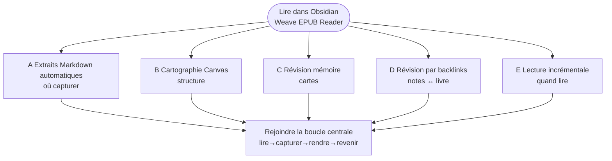
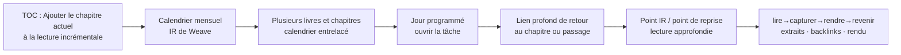

# Weave EPUB Reader

[中文](./README.zh-CN.md) | [繁體中文](./README.zh-TW.md) | [English](./README.md#english-documentation) | [Español](./README.es.md) | [Français](./README.fr.md) | [日本語](./README.ja.md) | [한국어](./README.ko.md) | [Русский](./README.ru.md) | [العربية](./README.ar.md)

---

## Introduction

Si vous voulez qu’**Obsidian soit plus qu’une archive de notes—un lieu où vous lisez vraiment**—Weave EPUB Reader mérite le détour.

Il convient à ceux qui capturent des phrases en Markdown en lisant ; aux chercheurs qui organisent des extraits sur Canvas ; aux utilisateurs de Weave qui transforment des passages en cartes de répétition espacée ; et à quiconque lit plusieurs livres à la fois et préfère un rythme de calendrier mensuel plutôt que « dix livres ouverts, une demi-page chacun ».

Démarrer est simple : placez un EPUB dans votre vault, ouvrez-le depuis l’étagère, sélectionnez du texte et créez un extrait. Chaque capture conserve un lien vers le même passage dans le livre ; lorsque vous modifiez, supprimez ou changez la couleur des notes, les surlignages dans le texte se mettent à jour. Cinq parcours plus complets—extraits automatiques, Canvas, cartes, backlinks et lecture incrémentale—sont diagrammés dans [Flux d’extraits et de notes](#flux-dextraits-et-de-notes) ci-dessous ; choisissez celui qui correspond à votre habitude.

## Liste des fonctions principales

### Lecture et étagère

- Lecture sur toutes les plateformes : bureau et mobile
- Lecture EPUB, TXT, FB2/FBZ, MOBI, AZW3, CBZ et PDF
- Mon étagère : import, couvertures, progression, recherche/filtre, statut de lecture
- Pagination / défilement continu, une / deux colonnes, contrôles de largeur et de typographie
- Progression de lecture persistante, signets, estimation du temps restant
- Points de lecture de référence (enregistrer / mettre à jour / aller)
- Dégradé translucide de lecture (Premium)
- Mode de lecture par paragraphes, plein écran immersif (Premium)
- Listes de lecture de l’étagère (Premium)

### Extraits et annotations

- Cinq couleurs de surlignage plus souligné / barré / souligné ondulé
- Bulles de pensée (`---div---`)
- Mode automatique : insérer dans les notes / copier dans le presse-papiers
- Rendu dans le corps et synchronisation pour Markdown / Canvas / paquets Weave
- Extraits par capture d’écran (peuvent continuer sur plusieurs pages)

### Résumés d’extraits

- Liste de cartes d’extraits (filtrer, trier, aller à la source)
- Vue chronologique des extraits (revoir par date, aller à la source ; Premium)
- Sélection par lots : exporter / supprimer
- Barre de densité de la carte du livre dans la barre latérale de la table des matières (Premium)
- Marques de chapitre dans la table des matières (important / question / maîtrisé ; Premium)

### Traçage et intégrations

- Liens profonds vers le livre écrits dans les extraits
- Traçage bidirectionnel précis : notes ↔ livre (Premium)
- Liaison Canvas, création automatique de nœuds et rendu
- Création de cartes / lecture incrémentale / IA (nécessite Weave ; ne consomme pas la licence Premium du lecteur)

### Exportation et aides

- Exporter le chapitre actuel en Markdown (Essential)
- Exporter les extraits de tout le livre / du chapitre et les chapitres marqués (Premium)
- Studio de modèles d’exportation avec préréglages intégrés
- Aperçu des notes de bas de page au survol (Premium)
- Interface multilingue (简体中文、繁體中文、English、日本語、한국어、Русский、Deutsch、Español、العربية) + tutoriel dans l’application

Voir [Expérience Essential et support Premium](#expérience-essential-et-support-premium) pour le regroupement des capacités.

Version minimale d’Obsidian : **1.8.7**

## Flux d’extraits et de notes

Les diagrammes ci-dessous résument la structure (Mermaid s’affiche sur **GitHub** et dans **Obsidian**).

### Diagramme 1 · Choisir un flux (carte par objectif)

Lire dans Obsidian est le centre ; chaque branche est un chemin typique selon l’objectif.

### Diagramme 2 · Sous-flux de lecture incrémentale (flux E)

Répond à **comment plusieurs livres avancent selon un calendrier** et complète les extraits automatiques (flux A) : **E planifie les chapitres ; A capture ce que vous avez noté**.

### Cinq flux typiques

#### A. Extraits Markdown automatiques (le plus courant)

Idéal lorsque **les notes sont votre espace principal pendant la lecture** :

1. **D’abord**, ouvrez une note Markdown comme carnet d’extraits et placez le curseur où les insertions doivent aller (la vue fractionnée fonctionne le mieux).
2. Ouvrez le lecteur et activez le **mode automatique** dans la barre d’outils (icône éclair : activé = insérer, désactivé = copier dans le presse-papiers).
3. Sélectionnez du texte dans le livre et créez un extrait → un bloc d’extrait localisé (avec un lien profond vers le livre) est **inséré à ce curseur**.
4. Après avoir enregistré la note, rouvrez le livre : les passages correspondants affichent des **surlignages dans le corps**—ce que vous avez capturé dans les notes est visible dans le livre.

Voir le [flux A](#a-extraits-markdown-automatiques-le-plus-courant) ci-dessus.

#### B. Cartographie visuelle sur Canvas

Idéal pour les **thèmes, la structure et les relations** :

1. **Liez** un fichier Canvas au livre actuel.
2. Avec le mode automatique activé, les extraits peuvent **créer automatiquement des nœuds Canvas** (la direction de mise en page est configurable).
3. Organisez les nœuds dans le Canvas ; le lecteur **réaffiche les extraits liés dans le livre**.

#### C. Révision mémoire

Idéal lorsque les extraits doivent entrer en **répétition espacée** :

1. Sélectionnez du texte → **Créer une carte** dans la barre d’outils → éditeur de cartes Weave.
2. Enregistrez dans `.wdeck` ou d’autres fichiers de paquet ; le lecteur **affiche des surlignages à partir des données du paquet**.
3. Révisez dans Weave ; revenez au livre lorsque vous avez besoin du passage original.

#### D. Révision par backlinks

Idéal pour **extraire d’abord, réviser ensuite, revenir à la source** :

1. Relisez d’anciens extraits dans Markdown / Canvas / paquets ; rouvrez le livre pour voir les **surlignages dans le corps**.
2. Cliquez sur un lien profond vers le livre dans une note → sautez au **passage original**.
3. Cliquez sur un surlignage dans le lecteur → **ouvrez la note source** (traçage bidirectionnel).

#### E. Lecture incrémentale : lecture approfondie entrelacée de plusieurs livres

Idéal lorsque vous voulez que **plusieurs livres avancent à un rythme** plutôt que de lire un livre de bout en bout d’une traite :

1. **Ajouter le chapitre actuel à la lecture incrémentale** : Dans la **table des matières** de la barre latérale du lecteur, utilisez **Ajouter à la lecture incrémentale** sur un chapitre (choisissez éventuellement un thème de lecture incrémentale) pour mettre ce chapitre en file.
2. **Planifier dans le calendrier mensuel** : Le chapitre apparaît dans le **calendrier mensuel de lecture incrémentale** de Weave aux côtés de points de lecture d’autres livres et chapitres—**lecture entrelacée de plusieurs livres** au lieu de laisser beaucoup de livres à moitié ouverts sur l’étagère.
3. **Lecture approfondie, pas superficielle** :  
   - Sélectionnez du texte → créez un **point de lecture incrémentale** (conserve un lien profond vers la source EPUB) pour un suivi au niveau du paragraphe ;  
   - Pendant la lecture, marquez un **point de reprise de lecture incrémentale** pour que la prochaine session IR revienne à l’**emplacement exact** dans le livre.  
4. Le jour programmé, ouvrez l’élément depuis le calendrier ou la liste de tâches → suivez le lien profond jusqu’au chapitre ou au passage, puis continuez avec extraits et backlinks.

Cela complète le flux A : **A est où vont les captures ; E est quand chaque chapitre est lu parmi plusieurs livres.**

### Comparé à « lecteur externe + collage manuel »

- **Moins de changements de contexte**—vous ne quittez pas Obsidian pour capturer une phrase.
- **Les extraits deviennent une connaissance durable du vault**—recherchables dans Markdown, Canvas ou paquets—pas dans l’historique du presse-papiers.
- **La révision garde la source en vue**—les notes indexent ce que vous avez lu ; le livre montre le contexte vivant via liens profonds et rendu.
- **Le même flux sur tous les appareils**—livres et notes vivent dans le vault et suivent votre configuration de synchronisation Obsidian.
- **Un rythme pour les longs livres ou plusieurs livres**—les chapitres entrent dans le calendrier de lecture incrémentale pour une progression planifiée et entrelacée.

Plus de détails : [Flux d’extraits et de notes](#flux-dextraits-et-de-notes) et [Liste des fonctions principales](#liste-des-fonctions-principales) ci-dessus.

## Expérience Essential et support Premium

| Capacité | Expérience Essential | Support Premium |
|----------|:--------------------:|:---------------:|
| **Toutes les plateformes** (bureau et mobile) | ✅ | ✅ |
| Lire **EPUB**, TOC, modes paginé/défilement, typographie et thèmes | ✅ | ✅ |
| Lire des livres texte brut **TXT** | ✅ | ✅ |
| Lire **FB2 / FBZ** | ✅ | ✅ |
| Lire **MOBI / AZW3 / CBZ** | ✅ | ✅ |
| **Cinq couleurs de surlignage**, annotations, extraits et **rendu dans le corps** | ✅ | ✅ |
| Styles **souligné / barré / souligné ondulé** | ✅ | ✅ |
| Vue **liste de cartes** des extraits | ✅ | ✅ |
| Vue **chronologie** des extraits | 🔒 | ✅ |
| **Barre de densité de la carte du livre** dans la barre latérale TOC | 🔒 | ✅ |
| **Marques de chapitre** dans la table des matières (important / question / maîtrisé) | 🔒 | ✅ |
| **Listes de lecture** de l’étagère | 🔒 | ✅ |
| **Traçage bidirectionnel** (sauts d’ancre, lecteur ↔ notes / Canvas / paquets) | 🔒 | ✅ |
| **Points de lecture de référence** (enregistrer / mettre à jour / aller) | ✅ | ✅ |
| **Dégradé translucide de lecture** | 🔒 | ✅ |
| **Mode de lecture par paragraphes**, plein écran immersif | 🔒 | ✅ |
| **Progression de lecture**, progression sur l’étagère, dernier emplacement, estimation du temps restant | ✅ | ✅ |
| **Signets de la page actuelle**, dossier de signets et navigation dans la liste de signets | ✅ | ✅ |
| Liaison **Canvas** et création automatique de nœuds | ✅ | ✅ |
| Aperçu des notes de bas de page au survol | 🔒 | ✅ |
| Exporter le chapitre actuel en Markdown | ✅ | ✅ |

> Légende : ✅ inclus · 🔒 nécessite le support Premium

- **Activer le support Premium** : licence EPUB uniquement dans les réglages du lecteur, ou héritage depuis un plugin principal **Weave** activé.
- **Création de cartes / lecture incrémentale / IA** : n’occupent pas un créneau de licence Premium EPUB distinct, mais nécessitent Weave ; l’IA nécessite aussi votre propre clé API.

Répartition officielle : [Expérience Essential et support Premium](#expérience-essential-et-support-premium) ci-dessus. Activez dans les réglages du lecteur. Conditions : [PREMIUM_TERMS.md](./PREMIUM_TERMS.md).

## Installation

### Option 1 : Plugins communautaires (recommandé)

1. Ouvrez **Réglages → Plugins communautaires → Parcourir**
2. Recherchez **Weave EPUB Reader**, installez et activez

### Option 2 : Installation manuelle

1. Téléchargez une [version GitHub](https://github.com/zhuzhige123/obsidian-weave-reader/releases) correspondant à la version de `manifest.json` :
   - `main.js`
   - `manifest.json`
   - `styles.css`
2. Copiez-les dans `.obsidian/plugins/weave-epub-reader/`
3. Redémarrez Obsidian et activez **Weave EPUB Reader** sous **Réglages → Plugins communautaires**

## Démarrage rapide

1. Ouvrez l’**étagère** depuis le ruban ou la palette de commandes ; puis importez ou ouvrez un livre de votre vault.
2. Créez ou ouvrez un fichier Markdown et placez le curseur où les extraits doivent aller ; activez **Extrait automatique** dans le lecteur. Sélectionnez du texte pour créer des surlignages, extraits ou signets—ils sont insérés à ce curseur.
3. Cliquez sur un surlignage dans le livre pour aller à sa note source depuis la barre d’outils ; dans le Markdown / Canvas qui contient l’extrait, cliquez sur l’icône livre à côté pour revenir au passage correspondant.
4. Menu du lecteur → **Aide** → **Tutoriel** pour le guide dans l’application. Pour les détails des flux, voir [Flux d’extraits et de notes](#flux-dextraits-et-de-notes) ci-dessus.

## Données et synchronisation

**Bon à synchroniser (dans le vault)** : fichiers de livres, extraits Markdown, fichiers Canvas, données de paquets Weave et notes de progression/signets par livre (par défaut `Weave EPUB Reader/data_*.md`).

**Généralement local (dossier du plugin)** : cache du lecteur, index, liaisons Canvas, points de lecture de référence et état local similaire. Préférez synchroniser le contenu du vault entre appareils plutôt que les fichiers de cache sous `.obsidian/plugins/weave-epub-reader/`.

## Confidentialité et réseau

- La lecture, le rendu, les extraits et les backlinks sont **locaux par défaut** ; le contenu du vault n’est pas téléversé de façon proactive.
- Les fonctions d’étagère, de backlinks et de localisation de source énumèrent les chemins de fichiers du vault localement ; la copie d’extraits ou de codes d’activation utilise le presse-papiers. Voir [PRIVACY.md](./PRIVACY.md).
- L’**activation du support Premium** peut contacter le service de licences (code d’activation, e-mail, résumé d’empreinte de l’appareil, etc.). Voir [PRIVACY.md](./PRIVACY.md).
- Les **fonctions d’IA** appellent les services tiers que vous configurez.

## FAQ

### Comment capturer correctement les extraits de lecture ?

Les extraits sont enregistrés à des emplacements concrets dans les fichiers Markdown, Canvas ou paquets Weave que vous choisissez. Le lecteur agrège les liens source de ces captures et affiche des surlignages dans le livre. Les sélections non enregistrées de cette façon ne font que clignoter brièvement et ne laissent aucune donnée durable. La bannière du tutoriel dans le lecteur l’explique plus en détail.

### Quel est le lien avec Weave ?

**Weave EPUB Reader fonctionne seul** : sans le plugin principal [Weave](https://github.com/zhuzhige123/anki-obsidian-plugin), vous pouvez toujours lire des EPUB, utiliser l’étagère et capturer des extraits avec rendu dans le corps. Avec Weave installé, vous pouvez aussi connecter les cartes de répétition espacée, le calendrier de lecture incrémentale, les actions d’IA, et hériter de la licence Weave pour le support Premium. Ce sont des **compagnons optionnels**, pas une dépendance obligatoire.

### Les extraits et notes peuvent-ils se synchroniser entre plateformes ?

**Oui.** Les captures vivent dans Markdown, Canvas, fichiers de paquets et autre contenu du vault, donc elles suivent la synchronisation Obsidian que vous utilisez déjà (Obsidian Sync, iCloud, vaults synchronisés dans le cloud, etc.) entre bureau et mobile. Synchronisez le contenu du vault ; le cache du lecteur sous le dossier du plugin n’a en général pas besoin de synchronisation entre appareils (voir [Données et synchronisation](#données-et-synchronisation) ci-dessus).

### Puis-je exporter mes notes ?

**Oui.** Les données d’extraits et de surlignages restent dans votre vault—vous pouvez lire, modifier et exporter le Markdown dans Obsidian, et le lecteur propose l’exportation de chapitres et des outils associés. **Les données sont locales par défaut** ; votre vault n’est pas téléversé de façon proactive.

### Pourquoi le support Premium est-il payant ?

Le support Premium **finance le développement continu** pour que le lecteur et le flux d’extraits continuent de s’améliorer. L’**expérience Essential est gratuite**—la lecture quotidienne, cinq couleurs de surlignage, annotations, extraits et rendu dans le corps sont pleinement utilisables sans payer. Activez le support Premium seulement lorsque vous souhaitez la chronologie des extraits, le traçage bidirectionnel, le mode de lecture par paragraphes et d’autres capacités avancées.

### Abonnement ou achat unique ?

Le support Premium est un **achat unique** (activez une fois, utilisez à long terme ; voir [conditions du support Premium](./PREMIUM_TERMS.md)), pas un abonnement mensuel.

### Impossible d’ouvrir des formats autres qu’EPUB ?

**EPUB, TXT, FB2/FBZ, MOBI, AZW3, CBZ et PDF** sont inclus dans l’expérience Essential. Voir [Expérience Essential et support Premium](#expérience-essential-et-support-premium) ci-dessus.

### Nom du dossier du plugin ?

ID du plugin : `weave-epub-reader` → `.obsidian/plugins/weave-epub-reader/`

## Plus de documentation

- [Introduction (chinois simplifié)](./README.md#中文文档)
- [Introduction (chinois traditionnel)](./README.zh-TW.md)
- [Español](./README.es.md) · [Français](./README.fr.md) · [العربية](./README.ar.md)
- [Confidentialité](./PRIVACY.md) · [Conditions du support Premium](./PREMIUM_TERMS.md) · [Support](./SUPPORT.md) · [Sécurité](./SECURITY.md)

## Licence et auteur

Le code source est publié sous [GPL-3.0-or-later](LICENSE).

- Author: Rabbit (zhuzhige)
- GitHub: https://github.com/zhuzhige123
