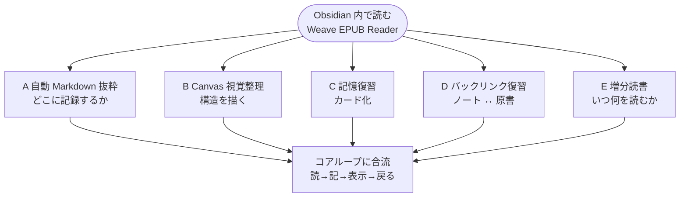
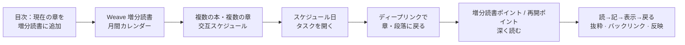

# Weave EPUB Reader

[中文](./README.zh-CN.md) | [繁體中文](./README.zh-TW.md) | [English](./README.md#english-documentation) | [Español](./README.es.md) | [Français](./README.fr.md) | [日本語](./README.ja.md) | [한국어](./README.ko.md) | [Русский](./README.ru.md) | [العربية](./README.ar.md)

---

## はじめに

**Obsidian をメモ置き場だけでなく、本当に読書する場所にしたい**なら、Weave EPUB Reader を試してみてください。

読みながら Markdown に文を残したい人、Canvas に抜粋を整理したい研究者、Weave で間隔反復のカードを作りたい人、複数の本を月間カレンダーで進めたい人——「10 冊開いて半ページずつ」ではなく、計画的に読み進めたい人に向いています。

始め方は軽いです。Vault に EPUB を入れ、本棚から開き、テキストを選択して抜粋するだけ。各抜粋には原書の位置情報が付きます。ノートを編集・削除・色変更すると、本文のハイライトも連動して更新されます。自動抜粋、Canvas、カード、バックリンク、増分読書の 5 つのワークフローは下の [抜粋とノートのワークフロー](#抜粋とノートのワークフロー) を参照してください。自分の習慣に合う道を選べます。

## コア機能チェックリスト

### 読書と本棚

- デスクトップ / モバイルの全プラットフォーム読書
- EPUB、TXT、FB2/FBZ、MOBI、AZW3、CBZ、PDF の読書
- マイ本棚：インポート、カバー、進捗、検索・フィルタ、読書ステータス
- ページ送り / 連続スクロール、単ページ / 二段組み、幅とタイポグラフィ調整
- 読書進捗の永続化、ブックマーク、残り時間の推定
- 参照読書ポイント（記録 / 更新 / ジャンプ）
- 通常読書の透光グラデーション（プレミアム）
- 段落読書モード、没入型フルスクリーン（プレミアム）
- 本棚プレイリスト（プレミアム）

### 抜粋と注釈

- 5 色ハイライト + 下線 / 取り消し線 / 波線
- 思考バブル（`---div---`）
- 自動モード：ノートへ挿入 / クリップボードへコピー
- Markdown / Canvas / Weave デッキの本文反映と同期
- スクリーンショット抜粋（ページをまたいで継続可能）

### 抜粋のまとめ

- 抜粋カード一覧（フィルタ、ソート、原文へジャンプ）
- 抜粋タイムライン表示（日付で振り返り、原文へジャンプ；プレミアム）
- 一括選択：エクスポート / 削除
- 目次サイドバーの全書マップ密度バー（プレミアム）
- 目次の章マーク（重要 / 疑問 / 習得済みなどの色付きドット；プレミアム）

### トレーシングと連携

- 抜粋への書籍ディープリンク書き込み
- 精密な双方向トレーシング：ノート ↔ 原書（プレミアム）
- Canvas の紐付け、ノード自動作成、反映
- カード作成 / 増分読書 / AI（Weave が必要；リーダーのプレミアムライセンスは消費しない）

### エクスポートと補助

- 現在の章を Markdown にエクスポート（基本）
- 全書 / 本章の抜粋、マーク付き章のエクスポート（プレミアム）
- エクスポートテンプレートスタジオと内蔵プリセット
- 脚注ホバープレビュー（プレミアム）
- 多言語 UI（简体中文、繁體中文、English、日本語、한국어、Русский、Deutsch、Español、العربية）+ アプリ内チュートリアル

機能の区分は [基本体験とプレミアムサポート](#基本体験とプレミアムサポート) を参照してください。

最低 Obsidian バージョン：**1.8.7**

## 抜粋とノートのワークフロー

以下の図は全体構造の概要です（Mermaid は **GitHub** と **Obsidian** の両方でレンダリングできます）。

### 図 1 · ワークフローの選び方（目的別）

Obsidian 内で読むことが中心。外側の各枝は、目的に応じた典型的な経路です。

### 図 2 · 増分読書サブフロー（ワークフロー E）

**複数の本をスケジュールで進める方法**を示し、自動抜粋（ワークフロー A）と補完関係にあります：**E が章のスケジュール、A が記録内容**を担当します。

### 5 つの典型的なワークフロー

#### A. 自動 Markdown 抜粋（最も一般的）

**読みながらノートを主戦場にする**場合に最適：

1. **まず** Markdown ノートを抜粋ノートとして開き、挿入位置にカーソルを置く（分割表示が最適）。
2. リーダーを開き、ツールバーの **自動モード** をオンにする（稲妻アイコン：オン = 挿入、オフ = クリップボードにコピー）。
3. 書籍内でテキストを選択して抜粋 → 位置情報付きの抜粋ブロック（書籍ディープリンク付き）が **そのカーソル位置に自動挿入** されます。
4. ノートを保存した後、同じ本を再度開くと、該当段落に **本文ハイライトが表示** されます——ノートに記録した内容が、本を開けば見えます。

詳細は上記 [ワークフロー A](#a-自動-markdown-抜粋最も一般的) を参照。

#### B. Canvas 視覚整理

**トピック整理、構造の可視化、論点の関係づけ**に最適：

1. 現在の本に Canvas ファイルを **紐付け** ます。
2. 自動モードをオンにすると、抜粋が **Canvas の新規ノードに自動書き込み** できます（レイアウト方向は設定可能）。
3. Canvas でノードを配置・接続・グループ化；リーダーは紐付け Canvas の抜粋を **本文に反映** します。

#### C. 記憶復習

抜粋を **間隔反復** に取り込みたい場合に最適：

1. テキストを選択 → ツールバーの **カード作成** → Weave カードエディタ。
2. `.wdeck` などのデッキファイルに保存；リーダーはデッキデータから **ハイライトを反映** します。
3. Weave で復習；必要に応じて原書の段落に戻れます。

#### D. バックリンク復習

**先に抜粋、後で復習、原文に戻る** 流れに最適：

1. Markdown / Canvas / デッキで過去の抜粋を確認；本を開くと **本文にハイライトが表示** されます。
2. ノート内の書籍ディープリンクをクリック → **原文段落** へジャンプ。
3. リーダー内のハイライトをクリック → **ソースノートをワンクリックで特定**（双方向トレーシング）。

#### E. 増分読書：複数書籍の交互・深読み

**一冊を一気に読むのではなく、複数の本をリズムよく進めたい** 場合に最適：

1. **現在の章を増分読書に追加**：リーダーサイドバーの **目次** で、章に **「増分読書に追加」** を使用（増分読書トピックを選択可能）。
2. **月間カレンダーで統一スケジュール**：章は Weave **増分読書月間カレンダー** に表示され、他の本・章の読書ポイントと一緒にスケジュール——本棚に多くの本を半分開いたままにするのではなく、**複数書籍の交互読書** を実現。
3. **浅読みではなく深読み**：  
   - テキストを選択 → **増分読書ポイント** を作成（EPUB ソースディープリンクを保持）；  
   - 読書中に **増分読書再開ポイント** をマークし、次回は増分読書フローから **書籍内の正確な位置** にワンクリックで戻る。  
4. スケジュール日に、カレンダーまたはタスクリストから該当項目を開く → ディープリンクで章・段落に戻り、抜粋・バックリンクワークフローと連携。

ワークフロー A（読みながら記録）と補完関係：**A は「どこに記録するか」、E は「いつどの章を読むか、複数の本をどう交互に進めるか」** を担当します。

### 「外部リーダー + 手動ペースト」と比較すると

- **コンテキスト切り替えが少ない**：1 文を記録するために Obsidian を離れる必要がありません。
- **抜粋が Vault 内に蓄積・検索可能**：Markdown / Canvas / デッキ内にあり、クリップボード履歴に散らばりません。
- **復習時も原文がそばにある**：ノートは索引、本は現場；ディープリンクと本文反映でつながります。
- **端末をまたいで同じワークフロー**：本とノートは Vault 内にあり、Obsidian の同期設定に従います。
- **長編・複数書籍にリズム**：章を増分読書カレンダーに入れ、スケジュールに沿って交互に進められます。

詳細は上記 [抜粋とノートのワークフロー](#抜粋とノートのワークフロー) と [コア機能チェックリスト](#コア機能チェックリスト) を参照。

## 基本体験とプレミアムサポート

| 機能 | 基本体験 | プレミアムサポート |
|------|:--------:|:------------------:|
| **全プラットフォーム**（デスクトップとモバイル） | ✅ | ✅ |
| **EPUB** 読書、目次、ページ送り/スクロール、版式とテーマ | ✅ | ✅ |
| **TXT** プレーンテキスト書籍 | ✅ | ✅ |
| **FB2 / FBZ** 読書 | ✅ | ✅ |
| **MOBI / AZW3 / CBZ** 読書 | ✅ | ✅ |
| **5 色ハイライト**、思考、抜粋、**本文反映** | ✅ | ✅ |
| **下線 / 取り消し線 / 波線** スタイル | ✅ | ✅ |
| 抜粋の**カード一覧** | ✅ | ✅ |
| 抜粋の**タイムライン**表示 | 🔒 | ✅ |
| 目次サイドバーの**全書マップ密度バー** | 🔒 | ✅ |
| 目次の**章マーク**（重要 / 疑問 / 習得済みなど） | 🔒 | ✅ |
| 本棚**プレイリスト** | 🔒 | ✅ |
| **双方向トレーシング**（アンカージャンプ、リーダー ↔ ノート / Canvas / デッキ） | 🔒 | ✅ |
| **参照読書ポイント**（記録 / 更新 / ジャンプ） | ✅ | ✅ |
| **通常読書の透光グラデーション** | 🔒 | ✅ |
| **段落読書モード**、没入型フルスクリーン | 🔒 | ✅ |
| **読書進捗**、本棚進捗、最終読書位置、残り時間推定 | ✅ | ✅ |
| **現在ページのブックマーク**、ブックマークフォルダ、リストからのジャンプ | ✅ | ✅ |
| **Canvas** 紐付けと自動ノード作成 | ✅ | ✅ |
| 脚注ホバープレビュー | 🔒 | ✅ |
| 現在の章を Markdown にエクスポート | ✅ | ✅ |

> 凡例：✅ 含む · 🔒 プレミアムサポートが必要

- **プレミアムサポートの有効化**：リーダー設定で EPUB 専用ライセンスを使用、または **Weave** メインプラグインが有効化済みならライセンスを継承可能。
- **カード作成 / 増分読書 / AI**：EPUB プレミアムライセンス枠は別途不要ですが Weave が必要；AI は独自の API キーが必要。

正式な対照表は上記 [基本体験とプレミアムサポート](#基本体験とプレミアムサポート)。有効化はリーダー設定から。条項：[PREMIUM_TERMS.md](./PREMIUM_TERMS.md)。

## インストール

### 方法 1：コミュニティプラグイン（推奨）

1. **設定 → コミュニティプラグイン → 参照** を開く
2. **Weave EPUB Reader** を検索し、インストールして有効化

### 方法 2：手動インストール

1. [GitHub Releases](https://github.com/zhuzhige123/obsidian-weave-reader/releases) から `manifest.json` のバージョンと一致するリリースをダウンロード：
   - `main.js`
   - `manifest.json`
   - `styles.css`
2. `.obsidian/plugins/weave-epub-reader/` にコピー
3. Obsidian を再起動し、**設定 → コミュニティプラグイン** で **Weave EPUB Reader** を有効化

## クイックスタート

1. リボンまたはコマンドパレットから **本棚** を開き、Vault から本をインポートまたは開く。
2. Markdown ファイルを新規作成または開き、抜粋を挿入したい位置にカーソルを置く；リーダーで **自動抜粋** をオンにする。テキストを選択してハイライト・抜粋・ブックマークを作成すると、その位置に自動挿入されます。
3. 本文のハイライトをクリックし、ツールバーからソースノートへジャンプ；抜粋を保存した Markdown / Canvas では、横の書籍アイコンをクリックすると書中の対応位置に戻れます。
4. リーダーメニュー → **ヘルプ** → **チュートリアル** でアプリ内ガイド。ワークフロー詳細は上記 [抜粋とノートのワークフロー](#抜粋とノートのワークフロー) を参照。

## データと同期

**同期推奨（Vault 内）**：書籍ファイル、Markdown 抜粋、Canvas、Weave デッキデータ、および各書籍の進捗・ブックマーク専用ノート（既定 `Weave EPUB Reader/data_*.md`）。

**通常ローカル（プラグインフォルダ）**：リーダーキャッシュ、インデックス、Canvas 紐付け、参照読書ポイントなどのローカル状態。端末間では Vault 内容の同期を優先し、`.obsidian/plugins/weave-epub-reader/` のキャッシュファイルは直接同期しないことを推奨。

## プライバシーとネットワーク

- 読書、レンダリング、抜粋、バックリンクは **デフォルトでローカル** 処理；Vault 内容は能動的にアップロードされません。
- 本棚、バックリンク、ソース特定機能はローカルで Vault ファイルパスを列挙；抜粋や有効化コードのコピー時にクリップボードにアクセス。[PRIVACY.md](./PRIVACY.md) を参照。
- **プレミアムサポート有効化** はライセンスサービスに接続する場合があります（有効化コード、メール、デバイスフィンガープリント概要など）。[PRIVACY.md](./PRIVACY.md) を参照。
- **AI 機能** はユーザーが設定したサードパーティサービスを呼び出します。

## よくある質問

### 読書抜粋ノートを正しく取るには？

抜粋は、選択した Markdown、Canvas、または Weave デッキファイル内の具体的な位置に保存されます。リーダーはそれらの抜粋にあるソースリンクを集約し、本文にハイライトを反映します。この保存条件を満たさない選択は、一瞬ハイライトされるだけで、同期可能な実データは残りません。リーダー上部のチュートリアルバナーに詳しい説明があります。

### Weave との関係は？

**Weave EPUB Reader は単独で動作します**：[Weave](https://github.com/zhuzhige123/anki-obsidian-plugin) メインプラグインがなくても、Obsidian 内で EPUB を読み、本棚を使い、基本抜粋と本文反映ができます。Weave をインストールすると、間隔反復カード、増分読書カレンダー、AI メニューなどに接続でき、Weave ライセンスを継承してプレミアムサポートを有効化できます。二者は **任意の連携** であり、必須依存ではありません。

### 抜粋ノートは全プラットフォームで同期できる？

**はい。** 抜粋は Vault 内の Markdown、Canvas、デッキなどに保存され、Obsidian Sync、iCloud、Vault 同期など、使用中の同期方式に従ってデスクトップとモバイル間で一致します。Vault 内容を同期することを推奨；リーダーキャッシュ等のプラグインフォルダデータは通常、端末間同期不要（上記 [データと同期](#データと同期) 参照）。

### ノートをエクスポートできる？

**はい。** 抜粋とハイライトデータは Vault 内に保存され、Obsidian で直接閲覧・編集・Markdown エクスポートが可能；リーダーにも章エクスポート等の機能があります。**データはデフォルトで完全ローカル** で、Vault 内容は能動的にアップロードされません。

### なぜプレミアムは有料？

プレミアムサポートは **継続的な開発を支える** ためのものです——開発者が長期的に読書・抜粋体験を磨き続けられるように。**基本体験は無料** で、日常読書、5 色ハイライト、思考、抜粋、本文反映などコア機能は無料で十分使えます。タイムライン表示、双方向トレーシング、段落読書モードなどの上級機能が必要な場合のみ、プレミアムサポートを有効化してください。

### サブスクリプション？買い切り？

プレミアムサポートは **買い切り**（一度有効化すれば長期利用；[プレミアムサポート条項](./PREMIUM_TERMS.md) 参照）で、月額サブスクリプションではありません。

### EPUB 以外の形式が開けない？

**EPUB、TXT、FB2/FBZ、MOBI、AZW3、CBZ、PDF** はすべて基本体験に含まれます。上記 [基本体験とプレミアムサポート](#基本体験とプレミアムサポート) を参照。

### プラグインフォルダ名は？

プラグイン ID：`weave-epub-reader` → `.obsidian/plugins/weave-epub-reader/`

## その他のドキュメント

- [プラグイン紹介（简体中文）](./README.md#中文文档)
- [プラグイン紹介（繁體中文）](./README.zh-TW.md)
- [Español](./README.es.md) · [Français](./README.fr.md) · [العربية](./README.ar.md)
- [プライバシー](./PRIVACY.md) · [プレミアムサポート条項](./PREMIUM_TERMS.md) · [サポート](./SUPPORT.md) · [セキュリティ](./SECURITY.md)

## ライセンスと作者

ソースコードは [GPL-3.0-or-later](LICENSE) で公開されています。

- Author: Rabbit (zhuzhige)
- GitHub: https://github.com/zhuzhige123
