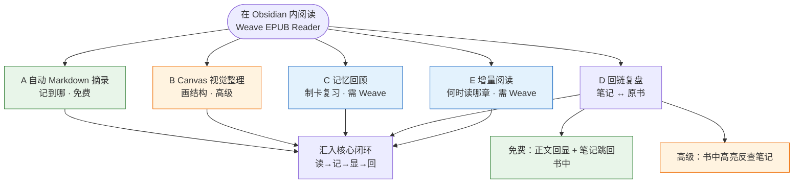
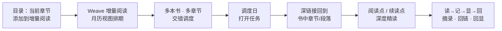
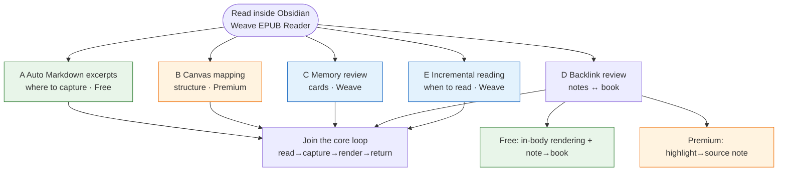
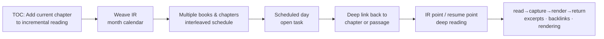

# Weave EPUB Reader

[中文](#中文文档) | [English](#english-documentation)

---

## 中文文档

### 插件介绍

如果你希望 **Obsidian 不只是笔记仓库，也是你正经读书的地方**，可以试试 Weave EPUB Reader。

它适合：边读边把句子记进 Markdown 的人；做专题研究、想把摘录画进 Canvas 的人；用 Weave 做间隔复习、想把书中段落制成卡片的人；同时推进多本书、需要月历排期而不是「开十本读半页」的人。

上手很轻：把 EPUB 放进 Vault，从书架打开，选中文字即可摘录。摘录会带着回到原书的位置信息；你改笔记、删摘录或换颜色，书里的高亮也会跟着变。更完整的五条工作流（自动摘录、Canvas、制卡、回链、增量阅读）见下方 [摘录笔记工作流](#摘录笔记工作流) 图示——按自己的习惯选一条路走即可。

最低 Obsidian 版本：**1.7.0**

## 摘录笔记工作流

下方图示概括整体结构（GitHub / Obsidian 均可渲染 Mermaid）。

### 图 1 · 五条工作流怎么选（按目标分流）

中心是「在 Obsidian 内读书」；向外是你可能走的五条路径，以及是否需要**高级版**或 **Weave**。

| 图例 | 含义 |
|------|------|
| 绿色路径 | 免费版即可起步 |
| 橙色路径 | 需阅读器**高级版**（或继承 Weave 授权） |
| 蓝色路径 | 需安装并启用 **Weave** 主插件 |

### 图 2 · 增量阅读子流程（工作流 E）

解决「**多本书如何交错推进、长书如何按章深度读**」，与自动摘录（工作流 A）互补：**E 管排期，A 管记下什么**。

### 五条典型工作流

#### A. 自动 Markdown 摘录（最常用，免费核心）

适合「边读边记、笔记就是主战场」：

1. **先**打开一本 Markdown 作为摘录笔记本，光标放在要插入的位置（与阅读器分屏体验最佳）。
2. 打开阅读器，开启工具栏 **自动模式**（闪电图标：开 = 插入，关 = 复制到剪贴板）。
3. 在书中选中文本并摘录 → 带定位的摘录块（含书籍深链接）**自动插入到上一步光标处**。
4. 保存笔记后，再次打开该书，正文会在对应段落**回显高亮**——你在笔记里记过什么，打开书就能看见。

详见 [自动化摘录流程](./docs/user/zh-CN/03-auto-excerpt-workflow.md)。

#### B. Canvas 视觉整理（高级）

适合「做专题、画结构、理清论点关系」：

1. 为当前书**绑定**一个 Canvas 文件。
2. 开启自动模式后，摘录可**自动写入 Canvas 新节点**（可调整节点排布方向）。
3. 在 Canvas 里拖拽、连线、分组；阅读器识别绑定 Canvas 中的摘录并**回显到正文**。

#### C. 记忆回顾（需安装 Weave）

适合「摘录之后要复习、要间隔重复」：

1. 选中文本 → 工具栏 **制卡**，进入 Weave 记忆卡片窗口。
2. 保存到 `.wdeck` 等牌组文件后，阅读器从牌组数据**回显高亮**。
3. 在 Weave 记忆模块中按牌组规则做复习；需要时仍可回到书中原文。

#### D. 回链复盘（免费回显 + 高级双向溯源）

适合「先摘录、后复习、再回原文」：

1. 在 Markdown / Canvas / 牌组笔记里查看历史摘录；打开书时正文侧已有**回显高亮**（免费）。
2. 点击笔记中的书籍深链接 → 跳回**原文段落**。
3. **高级版**：在阅读器里点击某条高亮 → **一键定位到来源笔记**，完成「笔记 ↔ 原书」双向溯源。

#### E. 增量阅读：多书交错与深度精读（需安装 Weave）

适合「**不想一次读完一本**、而是多本书按节奏交错推进，并在月历里看见整体阅读计划」：

> 阅读器提供**增量阅读入口**（不单独占用阅读器高级许可）；**调度、月历视图与任务队列**由 **Weave** 的增量阅读模块提供，需安装并启用 Weave。

1. **把当前章节加入增量阅读**：在阅读器侧边栏 **目录** 中，对某一章使用 **「添加到增量阅读」**（可选择一个增量阅读专题），将该章纳入增量阅读任务。
2. **进入月历视图统一调度**：章节会出现在 Weave **增量阅读月历视图** 中，与来自其他书籍、其他章节的阅读点一起排期——实现 **多本书的交错阅读**，而不是在书架里同时开很多本却都读不深。
3. **深度阅读而非浅尝辄止**：  
   - 选中文本 → 创建 **增量阅读点**（保留 EPUB 溯源深链接），把段落级内容纳入后续处理；  
   - 阅读过程中可标记 **增量阅读续读点**，下次从增量阅读流程**一键回到书中精确位置**继续。  
4. 到调度日时，从月历或任务列表打开对应项 → 经深链接回到原书章节/段落，与摘录、回链工作流衔接。

这与工作流 A（边读边记）互补：**A 解决「记到哪」；E 解决「何时读哪一章、多本书如何轮流推进」**。

### 和「只用外部阅读器 + 手动粘贴」相比

- **少一次上下文切换**：不必为了记一句而离开 Obsidian。
- **摘录可沉淀、可检索**：内容在 Vault 的 Markdown / Canvas / 牌组里，而不是散落在剪贴板历史里。
- **复习时原文仍在场**：笔记是索引，书是现场；两者通过深链接与正文回显连在一起。
- **多端一致**：书与笔记都在 Vault 里，随 Obsidian 同步策略走；手机读、桌面整理可以同一条链路（部分阅读进度等高级能力见上表）。
- **长书与多书有节奏**：章节可进入增量阅读月历，按调度交错阅读，而不是靠意志力硬啃单本。

更完整的操作说明见 [用户手册 · 产品介绍与工作流](./docs/user/zh-CN/00-introduction.md)、[联动与扩展 · 增量阅读](./docs/user/zh-CN/06-integrations.md#weave-主插件可选)。

## 核心能力

- **全平台**：桌面端（Windows、macOS、Linux）与移动端（iOS、Android）一致体验
- **多格式阅读**：Vault 内 **EPUB**（免费）；MOBI、AZW3、FB2、FBZ（`fb2.zip`）、CBZ、TXT 等（**高级版**或继承 Weave 授权）。插件名称含 EPUB，但不仅限于 EPUB
- **书架与阅读**：导入图书、章节目录、分页/连续滚动、字体与主题等版式设置
- **段落阅读模式**（高级版）：单段沉浸阅读、段内翻页与跨段导航
- **摘录、高亮与批注**：选区标注与批注；插入 Markdown / 复制 / 写入 Canvas（Canvas 写入属高级能力）
- **双向笔记数据同步**：笔记侧删除、改色、改类型后，正文高亮与回显自动更新（通常数秒内）
- **正文回显**：汇总 Markdown、Canvas、Weave 牌组中的摘录，在书中显示高亮
- **摘录为 Weave 记忆卡片**（需 Weave）：选区制卡，牌组摘录同样回显到书中
- **深链接与双向溯源**（溯源属高级版）：从笔记跳回书中；阅读器内点击高亮反查来源笔记 / Canvas / 牌组
- **当前章节加入增量阅读专题**（需 Weave）：目录「添加到增量阅读」，阅读点/续读点配合 Weave 月历调度
- **脚注浮窗预览**（高级版）
- **自动记录阅读位置**（高级版）：阅读进度持久化、书架进度、最后阅读点
- **预计剩余阅读时间**（高级版）：按阅读节奏估算全书/本章剩余时长
- **扩展**：书签、章节导出、截图、Canvas 绑定；AI 入口

## 免费版与高级版

| 能力 | 免费 | 高级 |
|------|:----:|:----:|
| 阅读 **EPUB**、目录跳转、翻页/滚动、版式与主题 | ✅ | — |
| 阅读 **MOBI / AZW3 / FB2 / FBZ / CBZ / TXT** | — | ✅ |
| 当前页书签 | ✅ | — |
| 基础高亮、批注、摘录与**正文回显** | ✅ | — |
| **阅读进度**持久化、自动保存、书架进度、最后阅读点 | — | ✅ |
| 段落阅读模式、参考阅读点 | — | ✅ |
| 下划线/删除线/波浪线等样式摘录 | — | ✅ |
| **Canvas** 绑定与自动写入节点 | — | ✅ |
| **双向溯源**（阅读器 ↔ 笔记/Canvas/牌组） | — | ✅ |
| 脚注浮窗预览、导出当前章节为 Markdown | — | ✅ |

- **激活**：在阅读器设置中使用 EPUB 独立激活码；若已安装并激活 **Weave 主插件**，可继承授权而无需重复输入。
- **制卡 / 增量阅读 / AI**：不单独占用阅读器高级许可，但需安装 Weave；AI 另需自行配置 API Key。

完整分层以 [功能对照表](./docs/user/zh-CN/00-feature-comparison.md) 为准；激活步骤见 [高级版与激活](./docs/user/zh-CN/08-premium-and-activation.md)，条款见 [PREMIUM_TERMS.md](./PREMIUM_TERMS.md)。

## 安装

### 方式一：社区插件（上架后推荐）

1. 打开 **设置 → 社区插件 → 浏览**
2. 搜索 **Weave EPUB Reader**，安装并启用

### 方式二：手动安装

1. 从 [GitHub Releases](https://github.com/zhuzhige123/obsidian-weave-reader/releases) 下载与 `manifest.json` 版本号一致的发布包，获取：
   - `main.js`
   - `manifest.json`
   - `styles.css`
   - `versions.json`（建议一并复制）
2. 复制到 `.obsidian/plugins/weave-epub-reader/`
3. 重启 Obsidian，在 **设置 → 社区插件** 中启用 **Weave EPUB Reader**

## 快速开始

1. 启用插件后，通过功能区图标或命令面板打开**书架**，从 Vault 导入或打开图书。
2. 在阅读器中选中文本，创建高亮、摘录或书签。
3. 使用工具栏进行章节跳转、显示设置与导出。
4. 阅读器菜单 → **帮助** → **使用教程** 可查看插件内精简教程。工作流细节见上文 [摘录笔记工作流](#摘录笔记工作流)。

## 数据与同步

**建议同步（位于 Vault）**：图书文件、Markdown 摘录、Canvas、Weave 牌组数据。

**通常不需跨设备同步（位于插件目录）**：阅读缓存、索引、部分界面状态。多设备使用时优先同步 Vault 内容，而非直接同步 `.obsidian/plugins/weave-epub-reader/` 下的缓存文件。

## 隐私与网络

- 阅读、渲染、摘录与回链等**默认在本地完成**，不会主动上传 Vault 内容。
- **高级版激活**可能访问许可证服务（激活码、邮箱、设备指纹摘要等），详见 [PRIVACY.md](./PRIVACY.md)。
- **AI 功能**会调用你自行配置的第三方服务。

## 常见问题

### 正文没有显示摘录高亮？

确认摘录由本插件生成、位于 Markdown / Canvas / Weave 牌组文件中，且打开的是**同一本书**。来源文件刚修改时，稍等片刻会自动刷新。

### 非 EPUB 格式打不开？

MOBI、AZW3、FB2 等格式需**高级版**。免费版可直接阅读 EPUB。

### 是否必须安装 Weave？

不必。独立即可阅读 EPUB 并使用基础摘录。制卡、增量阅读、AI 菜单需要 Weave。

### 插件文件夹名称？

插件 ID 为 `weave-epub-reader`，路径：`.obsidian/plugins/weave-epub-reader/`

## 更多文档

- [用户手册（简体中文）](./docs/user/zh-CN/README.md)
- [隐私说明](./PRIVACY.md) · [高级版说明](./PREMIUM_TERMS.md) · [支持](./SUPPORT.md) · [安全](./SECURITY.md)

## 许可证与作者

源码基于 [GPL-3.0-or-later](LICENSE) 发布。基础功能免费、高级功能付费属于产品分层，不改变 GPL 对已发布源码所赋予的权利。

- Author: Rabbit (zhuzhige)
- GitHub: https://github.com/zhuzhige123

---

## English Documentation

### Introduction

If you want **Obsidian to be more than a note archive—a place where you actually read**—Weave EPUB Reader is worth a look.

It fits readers who capture sentences into Markdown as they go; researchers who map excerpts onto Canvas; Weave users who turn passages into cards for spaced repetition; and anyone juggling several books who prefers a month-calendar rhythm over “ten books open, half a page each.”

Getting started is light: put an EPUB in your vault, open it from the bookshelf, select text, and excerpt. Each capture keeps a link back to the same passage in the book; when you edit, delete, or recolor notes, highlights in the text update to match. Five fuller paths—auto excerpts, Canvas, cards, backlinks, incremental reading—are diagrammed in [Excerpt and note workflows](#excerpt-and-note-workflows) below; follow the one that matches your habit.

Minimum Obsidian version: **1.7.0**

## Excerpt and note workflows

The diagrams below summarize the structure (Mermaid renders on **GitHub** and in **Obsidian**).

### Diagram 1 · Pick a workflow (goal-based map)

Reading in Obsidian is the hub; each branch is a typical path and its **Premium** / **Weave** requirements.

| Legend | Meaning |
|--------|---------|
| Green paths | Usable on the **free** tier |
| Orange paths | Requires reader **Premium** (or inherited Weave license) |
| Blue paths | Requires the **Weave** main plugin |

### Diagram 2 · Incremental reading subflow (workflow E)

Answers **how several books advance on a schedule** and complements auto excerpts (workflow A): **E schedules chapters; A captures what you noted**.

### Five typical workflows

#### A. Auto Markdown excerpts (most common, free core)

Best when **notes are your primary workspace while reading**:

1. **First**, open a Markdown note as your excerpt notebook and place the cursor where inserts should go (split view works best).
2. Open the reader and turn on **Auto mode** in the toolbar (lightning icon: on = insert, off = copy to clipboard).
3. Select text in the book and excerpt → a located excerpt block (with a book deep link) is **inserted at that cursor**.
4. After saving the note, reopen the book: matching passages show **highlights in the body**—what you captured in notes is visible in the book.

See [automated excerpt workflow (zh-CN)](./docs/user/zh-CN/03-auto-excerpt-workflow.md).

#### B. Canvas visual mapping (Premium)

Best for **topics, structure, and relationships**:

1. **Bind** a Canvas file to the current book.
2. With Auto mode on, excerpts can **auto-create Canvas nodes** (layout direction is configurable).
3. Arrange nodes in the Canvas; the reader **renders related excerpts back into the book**.

#### C. Memory review (requires Weave)

Best when excerpts should enter **spaced repetition**:

1. Select text → **Make card** in the toolbar → Weave card editor.
2. Save to `.wdeck` or other deck files; the reader **renders highlights from deck data**.
3. Review in Weave; jump back to the book when you need the original passage.

#### D. Backlink review (free in-body rendering + Premium two-way tracing)

Best for **excerpt first, review later, return to source**:

1. Review past excerpts in Markdown / Canvas / decks; reopen the book to see **highlights in the body** (free).
2. Click a book deep link in a note → jump to the **original passage**.
3. **Premium**: click a highlight in the reader → **open the source note** (two-way tracing).

#### E. Incremental reading: interleaved multi-book deep reading (requires Weave)

Best when you want **several books to advance on a rhythm** instead of reading one cover-to-cover in a single sprint:

> The reader exposes **incremental reading entry points** (no separate EPUB Premium slot for the entry itself). **Scheduling, the month calendar view, and task queues** come from Weave’s incremental reading module—you need Weave installed and enabled.

1. **Add the current chapter to incremental reading**: In the reader sidebar **table of contents**, use **Add to incremental reading** on a chapter (optionally pick an incremental-reading topic) to enqueue that chapter.
2. **Schedule in the month calendar**: The chapter appears in Weave’s **incremental reading month calendar** alongside reading points from other books and chapters—**interleaved multi-book reading** instead of leaving many books half-open on the shelf.
3. **Deep reading, not skimming**:  
   - Select text → create an **incremental reading point** (keeps an EPUB source deep link) for paragraph-level follow-up;  
   - While reading, mark an **incremental reading resume point** so the next IR session jumps back to the **exact location** in the book.  
4. On a scheduled day, open the item from the calendar or task list → follow the deep link back to the chapter or passage, then continue with excerpts and backlinks.

This complements workflow A: **A is where captures go; E is when each chapter gets read across multiple books.**

### Compared with “external reader + manual paste”

- **Fewer context switches**—no leaving Obsidian to capture a sentence.
- **Excerpts become durable vault knowledge**—searchable in Markdown, Canvas, or decks—not clipboard history.
- **Review keeps the source in view**—notes index what you read; the book shows the live context via deep links and rendering.
- **Same workflow across devices**—books and notes live in the vault and follow your Obsidian sync setup (some progress features are Premium; see table below).
- **Rhythm for long or multiple books**—chapters enter the incremental reading calendar for scheduled, interleaved progress.

More detail: [introduction and workflows (zh-CN)](./docs/user/zh-CN/00-introduction.md), [integrations · incremental reading (zh-CN)](./docs/user/zh-CN/06-integrations.md#weave-主插件可选).

## Core capabilities

- **All platforms**: Desktop (Windows, macOS, Linux) and mobile (iOS, Android) with a consistent workflow
- **Multi-format reading**: **EPUB** in the vault (free); MOBI, AZW3, FB2, FBZ (`fb2.zip`), CBZ, TXT, and more (**Premium** or inherited Weave license). Despite the name, the plugin is not EPUB-only
- **Bookshelf and reading**: Import books, chapter TOC, paginated or continuous scrolling, typography and themes
- **Paragraph reading mode** (Premium): Immersive single-paragraph view with in-paragraph paging and cross-paragraph navigation
- **Excerpts, highlights, and annotations**: Select and annotate text; insert into Markdown, copy, or send to Canvas (Canvas writing is Premium)
- **Two-way note sync**: Deletes, color changes, and type changes in notes update in-body highlights and rendering (usually within a few seconds)
- **Live rendering**: Aggregate excerpts from Markdown, Canvas, and Weave decks and show them in the book
- **Excerpts as Weave memory cards** (requires Weave): Make cards from selections; deck excerpts also render in the book
- **Deep links and two-way tracing** (tracing is Premium): Jump from notes into the book; click a highlight in the reader to open the source note / Canvas / deck
- **Add current chapter to incremental reading** (requires Weave): TOC “add to incremental reading”, with reading/resume points scheduled in Weave’s month calendar
- **Footnote hover preview** (Premium)
- **Automatic reading position** (Premium): Persisted progress, bookshelf progress, and last location
- **Estimated remaining reading time** (Premium): Pace-based estimates for the book and current chapter
- **Extensions**: Bookmarks, chapter export, screenshots, Canvas binding; AI entry points

## Free and Premium

| Capability | Free | Premium |
|------------|:----:|:-------:|
| Read **EPUB**, TOC, paginated/scroll modes, typography and themes | ✅ | — |
| Read **MOBI / AZW3 / FB2 / FBZ / CBZ / TXT** | — | ✅ |
| Current-page bookmarks | ✅ | — |
| Basic highlights, annotations, excerpts, and **in-body rendering** | ✅ | — |
| **Reading progress** persistence, auto-save, bookshelf progress, last location | — | ✅ |
| Paragraph reading mode, reference reading points | — | ✅ |
| Underline / strikethrough / wavy styled excerpts | — | ✅ |
| **Canvas** binding and auto node creation | — | ✅ |
| **Two-way source navigation** (reader ↔ notes / Canvas / decks) | — | ✅ |
| Footnote hover preview, export current chapter to Markdown | — | ✅ |

- **Activation**: EPUB-only license in reader settings, or inherit from an activated **Weave** main plugin.
- **Card making / incremental reading / AI**: No separate EPUB Premium slot, but require Weave; AI also needs your own API key.

Authoritative breakdown: [feature comparison (zh-CN)](./docs/user/zh-CN/00-feature-comparison.md). Activation: [premium guide (zh-CN)](./docs/user/zh-CN/08-premium-and-activation.md). Terms: [PREMIUM_TERMS.md](./PREMIUM_TERMS.md).

## Installation

### Option 1: Community plugins (recommended when listed)

1. Open **Settings → Community plugins → Browse**
2. Search for **Weave EPUB Reader**, install, and enable

### Option 2: Manual installation

1. Download a [GitHub release](https://github.com/zhuzhige123/obsidian-weave-reader/releases) matching the version in `manifest.json`:
   - `main.js`
   - `manifest.json`
   - `styles.css`
   - `versions.json` (recommended)
2. Copy into `.obsidian/plugins/weave-epub-reader/`
3. Restart Obsidian and enable **Weave EPUB Reader** under **Settings → Community plugins**

## Quick start

1. Open the **bookshelf** from the ribbon or command palette, then import or open a book.
2. Select text to create highlights, excerpts, or bookmarks.
3. Use the toolbar for chapter navigation, display settings, and export.
4. Reader menu → **Help** → **Tutorial** for in-app guidance. For workflow details, see [Excerpt and note workflows](#excerpt-and-note-workflows) above.

## Data and sync

**Good to sync (in the vault)**: Book files, Markdown excerpts, Canvas files, Weave deck data.

**Usually local (plugin folder)**: Reader cache, indexes, some UI state. Prefer syncing vault content across devices rather than `.obsidian/plugins/weave-epub-reader/` cache files.

## Privacy and network

- Reading, rendering, excerpting, and backlinks are **local by default**; vault content is not uploaded proactively.
- **Premium activation** may contact the license service (activation code, email, device fingerprint summary, etc.). See [PRIVACY.md](./PRIVACY.md).
- **AI features** call the third-party services you configure.

## FAQ

### Excerpt highlights not showing in the book?

Confirm the excerpt was created by this plugin, lives in Markdown / Canvas / Weave deck data, and you opened the **same book**. Recent edits refresh automatically after a short delay.

### Cannot open MOBI / AZW3 / FB2?

Non-EPUB formats require **Premium**. EPUB works on the free tier.

### Is Weave required?

No for core EPUB reading and basic excerpts. Card making, incremental reading, and AI menus need Weave.

### Plugin folder name?

Plugin ID: `weave-epub-reader` → `.obsidian/plugins/weave-epub-reader/`

## More documentation

- [User manual (Simplified Chinese)](./docs/user/zh-CN/README.md)
- [Privacy](./PRIVACY.md) · [Premium terms](./PREMIUM_TERMS.md) · [Support](./SUPPORT.md) · [Security](./SECURITY.md)

## License and author

Source code is released under [GPL-3.0-or-later](LICENSE). Free core plus paid Premium is a product tier; it does not remove GPL rights for published source.

- Author: Rabbit (zhuzhige)
- GitHub: https://github.com/zhuzhige123
