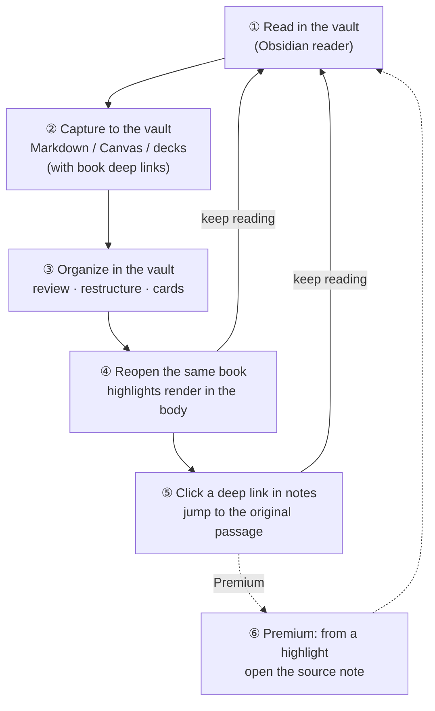
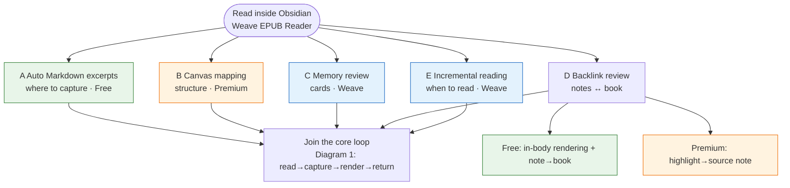
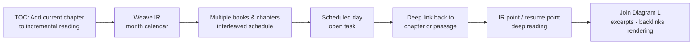

# Weave EPUB Reader

[中文版 README](./README.zh-CN.md)

Weave EPUB Reader is a **multi-format ebook reader** for **all Obsidian platforms** (desktop and mobile). It connects **read in the book → capture in notes → jump back from notes → see past excerpts in the body** into one loop (see [Excerpt and note workflows](#excerpt-and-note-workflows-what-changes-after-you-install) below).

**You do not need the main Weave plugin** to get started: open EPUBs from your vault, use the bookshelf, and create basic highlights and excerpts. With [Weave](https://github.com/zhuzhige123/anki-obsidian-plugin) installed, you also get card-making, incremental reading, AI actions, and shared license inheritance.

Minimum Obsidian version: **1.7.0**

## Excerpt and note workflows: what changes after you install

If your habit today is **read in an external app → copy a paragraph → paste into Obsidian → lose the original location a week later**, this plugin is meant to replace that whole chain—not just add another reader pane.

**Reading stays inside Obsidian, excerpts land in your vault, and location metadata travels with each excerpt.** The three diagrams below summarize the structure (Mermaid renders on **GitHub** and in **Obsidian**).

### Diagram 1 · Core loop (main value chain)

Every workflow eventually feeds this repeatable loop: **read → capture → render → return**.

### Diagram 2 · Pick a workflow (goal-based map)

Reading in Obsidian is the hub; each branch is a typical path and its **Premium** / **Weave** requirements.

| Legend | Meaning |
|--------|---------|
| Green paths | Usable on the **free** tier |
| Orange paths | Requires reader **Premium** (or inherited Weave license) |
| Blue paths | Requires the **Weave** main plugin |

### Diagram 3 · Incremental reading subflow (workflow E)

Answers **how several books advance on a schedule** and complements Diagram 1: **E schedules chapters; A captures what you noted**.

### Problems it addresses

| Before | After installing |
|--------|------------------|
| Reading and notes live in separate apps | Books and notes in one place; split view: notes left, book right |
| Excerpts are plain text without reliable anchors | Excerpt blocks include book deep links back to the **same passage** |
| Hard to recall original context when reviewing notes | Reopen the book and see historical highlights in the text |
| Visual research stuck in long quote lists | Bind a Canvas; excerpts become nodes and render back in the book (Premium) |
| Want spaced repetition from reading | Send excerpts to Weave decks; deck excerpts also render in the book (requires Weave) |
| Juggling several books or never finishing long ones | Add the **current chapter** to incremental reading and schedule **interleaved deep reading** in the **month calendar** (requires Weave) |

### Five typical workflows

#### A. Auto Markdown excerpts (most common, free core)

Best when **notes are your primary workspace while reading**:

1. **First**, open a Markdown note as your excerpt notebook and place the cursor where inserts should go (split view works best).
2. Open the reader and turn on **Auto mode** in the toolbar (lightning icon: on = insert, off = copy to clipboard).
3. Select text in the book and excerpt → a located excerpt block (with a book deep link) is **inserted at that cursor**.
4. After saving the note, reopen the book: matching passages show **highlights in the body**—what you captured in notes is visible in the book.

See [automated excerpt workflow (zh-CN)](./docs/user/zh-CN/03-auto-excerpt-workflow.md).

#### B. Canvas visual mapping (Premium)

Best for **topics, structure, and relationships**:

1. **Bind** a Canvas file to the current book.
2. With Auto mode on, excerpts can **auto-create Canvas nodes** (layout direction is configurable).
3. Arrange nodes in the Canvas; the reader **renders related excerpts back into the book**.

#### C. Memory review (requires Weave)

Best when excerpts should enter **spaced repetition**:

1. Select text → **Make card** in the toolbar → Weave card editor.
2. Save to `.wdeck` or other deck files; the reader **renders highlights from deck data**.
3. Review in Weave; jump back to the book when you need the original passage.

#### D. Backlink review (free in-body rendering + Premium two-way tracing)

Best for **excerpt first, review later, return to source**:

1. Review past excerpts in Markdown / Canvas / decks; reopen the book to see **highlights in the body** (free).
2. Click a book deep link in a note → jump to the **original passage**.
3. **Premium**: click a highlight in the reader → **open the source note** (two-way tracing).

#### E. Incremental reading: interleaved multi-book deep reading (requires Weave)

Best when you want **several books to advance on a rhythm** instead of reading one cover-to-cover in a single sprint:

> The reader exposes **incremental reading entry points** (no separate EPUB Premium slot for the entry itself). **Scheduling, the month calendar view, and task queues** come from Weave’s incremental reading module—you need Weave installed and enabled.

1. **Add the current chapter to incremental reading**: In the reader sidebar **table of contents**, use **Add to incremental reading** on a chapter (optionally pick an incremental-reading topic) to enqueue that chapter.
2. **Schedule in the month calendar**: The chapter appears in Weave’s **incremental reading month calendar** alongside reading points from other books and chapters—**interleaved multi-book reading** instead of leaving many books half-open on the shelf.
3. **Deep reading, not skimming**:  
   - Select text → create an **incremental reading point** (keeps an EPUB source deep link) for paragraph-level follow-up;  
   - While reading, mark an **incremental reading resume point** so the next IR session jumps back to the **exact location** in the book.  
4. On a scheduled day, open the item from the calendar or task list → follow the deep link back to the chapter or passage, then continue with excerpts and backlinks.

This complements workflow A: **A is where captures go; E is when each chapter gets read across multiple books.**

### Compared with “external reader + manual paste”

- **Fewer context switches**—no leaving Obsidian to capture a sentence.
- **Excerpts become durable vault knowledge**—searchable in Markdown, Canvas, or decks—not clipboard history.
- **Review keeps the source in view**—notes index what you read; the book shows the live context via deep links and rendering.
- **Same workflow across devices**—books and notes live in the vault and follow your Obsidian sync setup (some progress features are Premium; see table below).
- **Rhythm for long or multiple books**—chapters enter the incremental reading calendar for scheduled, interleaved progress.

More detail: [introduction and workflows (zh-CN)](./docs/user/zh-CN/00-introduction.md), [integrations · incremental reading (zh-CN)](./docs/user/zh-CN/06-integrations.md#weave-主插件可选).

## Platforms and formats

| Platform | Notes |
|----------|--------|
| Desktop | Windows, macOS, Linux |
| Mobile | iOS, Android (`isDesktopOnly: false` in `manifest.json`) |

| Format | Notes |
|--------|--------|
| **EPUB** | Available on the free tier |
| MOBI, AZW3, FB2, FBZ (`fb2.zip`), CBZ, TXT | Require **Premium** activation (or inherited Weave license) |

Despite the name, the plugin is **not EPUB-only**. See the table above for the current release.

## Core capabilities

- **Bookshelf and reading**: Import books from the vault, chapter TOC, paginated or continuous scrolling, typography and themes
- **Excerpts and highlights**: Select text, insert into Markdown, copy, or send to Canvas (Canvas writing is Premium)
- **Live rendering**: Aggregate excerpts from Markdown, Canvas, and Weave decks and show them in the book (usually refreshes within a few seconds after source edits)
- **Deep links**: Jump from notes back into the book; Premium adds **two-way source navigation** between reader and notes / Canvas / decks
- **Extensions**: Bookmarks, chapter export, screenshots, Canvas binding; **incremental reading** (TOC “add to incremental reading”, reading/resume points → Weave month calendar; requires Weave) and AI entry points

## Free and Premium

| Capability | Free | Premium |
|------------|:----:|:-------:|
| Read **EPUB**, TOC, paginated/scroll modes, typography and themes | ✅ | — |
| Read **MOBI / AZW3 / FB2 / FBZ / CBZ / TXT** | — | ✅ |
| Current-page bookmarks | ✅ | — |
| Basic highlights, annotations, excerpts, and **in-body rendering** | ✅ | — |
| **Reading progress** persistence, auto-save, bookshelf progress, last location | — | ✅ |
| Paragraph reading mode, reference reading points | — | ✅ |
| Underline / strikethrough / wavy styled excerpts | — | ✅ |
| **Canvas** binding and auto node creation | — | ✅ |
| **Two-way source navigation** (reader ↔ notes / Canvas / decks) | — | ✅ |
| Footnote hover preview, export current chapter to Markdown | — | ✅ |

- **Activation**: EPUB-only license in reader settings, or inherit from an activated **Weave** main plugin.
- **Card making / incremental reading / AI**: No separate EPUB Premium slot, but require Weave; AI also needs your own API key.

Authoritative breakdown: [feature comparison (zh-CN)](./docs/user/zh-CN/00-feature-comparison.md). Activation: [premium guide (zh-CN)](./docs/user/zh-CN/08-premium-and-activation.md). Terms: [PREMIUM_TERMS.md](./PREMIUM_TERMS.md).

## Installation

### Option 1: Community plugins (recommended when listed)

1. Open **Settings → Community plugins → Browse**
2. Search for **Weave EPUB Reader**, install, and enable

### Option 2: Manual installation

1. Download a [GitHub release](https://github.com/zhuzhige123/obsidian-weave-reader/releases) matching the version in `manifest.json`:
   - `main.js`
   - `manifest.json`
   - `styles.css`
   - `versions.json` (recommended)
2. Copy into `.obsidian/plugins/weave-epub-reader/`
3. Restart Obsidian and enable **Weave EPUB Reader** under **Settings → Community plugins**

## Quick start

1. Open the **bookshelf** from the ribbon or command palette, then import or open a book.
2. Select text to create highlights, excerpts, or bookmarks.
3. Use the toolbar for chapter navigation, display settings, and export.
4. Reader menu → **Help** → **Tutorial** for in-app guidance. For workflow details, see [Excerpt and note workflows](#excerpt-and-note-workflows-what-changes-after-you-install) above.

## Data and sync

**Good to sync (in the vault)**: Book files, Markdown excerpts, Canvas files, Weave deck data.

**Usually local (plugin folder)**: Reader cache, indexes, some UI state. Prefer syncing vault content across devices rather than `.obsidian/plugins/weave-epub-reader/` cache files.

## Privacy and network

- Reading, rendering, excerpting, and backlinks are **local by default**; vault content is not uploaded proactively.
- **Premium activation** may contact the license service (activation code, email, device fingerprint summary, etc.). See [PRIVACY.md](./PRIVACY.md).
- **AI features** call the third-party services you configure.

## FAQ

### Excerpt highlights not showing in the book?

Confirm the excerpt was created by this plugin, lives in Markdown / Canvas / Weave deck data, and you opened the **same book**. Recent edits refresh automatically after a short delay.

### Cannot open MOBI / AZW3 / FB2?

Non-EPUB formats require **Premium**. EPUB works on the free tier.

### Is Weave required?

No for core EPUB reading and basic excerpts. Card making, incremental reading, and AI menus need Weave.

### Plugin folder name?

Plugin ID: `weave-epub-reader` → `.obsidian/plugins/weave-epub-reader/`

## More documentation

- [User manual (Simplified Chinese)](./docs/user/zh-CN/README.md)
- [Privacy](./PRIVACY.md) · [Premium terms](./PREMIUM_TERMS.md) · [Support](./SUPPORT.md) · [Security](./SECURITY.md)

## License and author

Source code is released under [GPL-3.0-or-later](LICENSE). Free core plus paid Premium is a product tier; it does not remove GPL rights for published source.

- Author: Rabbit (zhuzhige)
- GitHub: https://github.com/zhuzhige123
