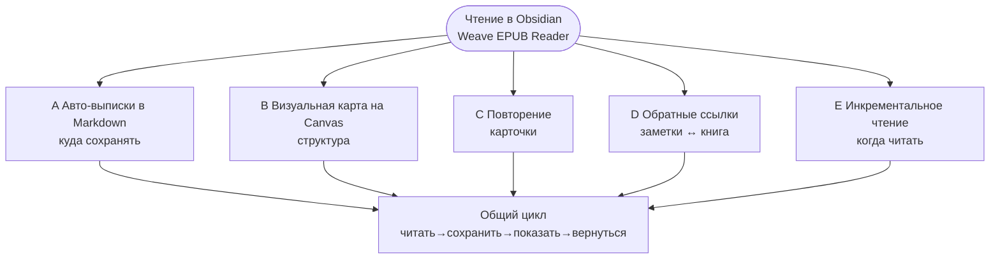

# Weave EPUB Reader

[中文](./README.zh-CN.md) | [繁體中文](./README.zh-TW.md) | [English](./README.md#english-documentation) | [日本語](./README.ja.md) | [한국어](./README.ko.md) | [Русский](./README.ru.md)

---

## Введение

Если вы хотите, чтобы **Obsidian был не только архивом заметок, но и местом, где вы действительно читаете**, попробуйте Weave EPUB Reader.

Плагин подойдёт тем, кто сохраняет цитаты в Markdown по ходу чтения; исследователям, которые выстраивают структуру на Canvas; пользователям Weave, делающим карточки для интервального повторения; и тем, кто ведёт несколько книг по календарному ритму, а не «десять книг открыто — по полстраницы в каждой».

Начать просто: положите EPUB в Vault, откройте книгу с полки, выделите текст и сделайте выписку. К каждой выписке привязывается место в книге; при редактировании, удалении или смене цвета заметок подсветка в тексте обновляется. Пять типичных сценариев — автоматические выписки, Canvas, карточки, обратные ссылки, инкрементальное чтение — описаны ниже в разделе [Рабочие процессы с выписками и заметками](#рабочие-процессы-с-выписками-и-заметками). Выберите тот, что ближе вашей привычке.

## Контрольный список основных возможностей

### Чтение и полка

- Чтение на всех платформах: десктоп и мобильные
- Чтение EPUB, TXT и FB2/FBZ (MOBI, AZW3 и CBZ — Premium)
- Моя полка: импорт, обложки, прогресс, поиск/фильтр, статус чтения
- Постраничный / непрерывный скролл, одна / две колонки, ширина и типографика
- Сохранение прогресса чтения, закладки, оценка оставшегося времени
- Режим чтения по абзацам, иммерсивный полноэкранный режим, опорные точки чтения (Premium)
- Плейлисты полки (Premium)

### Выписки и аннотации

- Пять цветов подсветки плюс подчёркивание / зачёркивание / волнистая линия
- Мысли-пузыри (`---div---`)
- Авторежим: вставка в заметки / копирование в буфер
- Отображение и синхронизация в тексте для Markdown / Canvas / колод Weave
- Выписки со скриншотов (можно продолжать на следующих страницах)

### Сводка выписок

- Список карточек выписок (фильтр, сортировка, переход к источнику)
- Временная шкала выписок (обзор по датам, переход к источнику)
- Массовый выбор: экспорт / удаление
- Полоса плотности карты книги в боковой панели оглавления

### Трассировка и интеграции

- Глубокие ссылки на книгу в выписках
- Точная двусторонняя трассировка: заметки ↔ книга (Premium)
- Привязка Canvas, автоматическое создание узлов и отображение
- Создание карточек / инкрементальное чтение / AI (нужен Weave; не занимает лицензию Premium читалки)

### Экспорт и вспомогательные функции

- Экспорт текущей главы в Markdown (базовый уровень)
- Экспорт выписок всей книги / главы и отмеченных глав (Premium)
- Студия шаблонов экспорта со встроенными пресетами
- Предпросмотр сносок при наведении (Premium)
- Многоязычный интерфейс (简体中文, 繁體中文, English, 日本語, 한국어, Русский, Deutsch, Español, العربية) + встроенный учебник

Разделение возможностей — в таблице [Базовый опыт и Premium support](#базовый-опыт-и-premium-support).

Минимальная версия Obsidian: **1.8.7**

## Рабочие процессы с выписками и заметками

Диаграммы ниже обобщают структуру (Mermaid рендерится на **GitHub** и в **Obsidian**).

### Схема 1 · Выбор рабочего процесса (по цели)

В центре — чтение в Obsidian; от него отходят типичные пути в зависимости от задачи.

### Схема 2 · Подпроцесс инкрементального чтения (процесс E)

Отвечает на вопрос **как несколько книг продвигаются по расписанию** и дополняет авто-выписки (процесс A): **E планирует главы; A фиксирует, что вы записали**.

### Пять типичных рабочих процессов

#### A. Автоматические выписки в Markdown (самый частый)

Подходит, когда **заметки — основное рабочее место во время чтения**:

1. **Сначала** откройте Markdown-заметку для выписок и поставьте курсор туда, куда нужно вставлять (удобнее всего в режиме разделённого экрана).
2. Откройте читалку и включите **Авторежим** на панели инструментов (иконка молнии: вкл. = вставка, выкл. = копирование в буфер).
3. Выделите текст в книге и сделайте выписку → блок с привязкой к месту (с глубокой ссылкой на книгу) **вставляется в позицию курсора**.
4. После сохранения заметки снова откройте книгу: на соответствующих абзацах появится **подсветка в тексте** — то, что вы записали в заметках, видно в книге.

Подробнее: [процесс A](#a-автоматические-выписки-в-markdown-самый-частый) выше.

#### B. Визуальная карта на Canvas

Подходит для **тем, структуры и связей между тезисами**:

1. **Привяжите** Canvas-файл к текущей книге.
2. При включённом авторежиме выписки могут **автоматически создавать узлы Canvas** (направление раскладки настраивается).
3. Расставьте узлы на Canvas; читалка **отображает связанные выписки обратно в тексте книги**.

#### C. Повторение и память

Подходит, когда выписки должны попасть в **интервальное повторение**:

1. Выделите текст → **Создать карточку** на панели → редактор карточек Weave.
2. Сохраните в `.wdeck` или другой файл колоды; читалка **отображает подсветку из данных колоды**.
3. Повторяйте в Weave; при необходимости возвращайтесь к исходному абзацу в книге.

#### D. Обзор по обратным ссылкам

Подходит для сценария **сначала выписка, потом повтор, затем возврат к источнику**:

1. Просмотрите прошлые выписки в Markdown / Canvas / колодах; откройте книгу — **подсветка уже в тексте**.
2. Нажмите глубокую ссылку на книгу в заметке → переход к **исходному абзацу**.
3. Нажмите подсветку в читалке → **откройте исходную заметку** (двусторонняя трассировка).

#### E. Инкрементальное чтение: чередование нескольких книг и глубокое чтение

Подходит, когда вы хотите **вести несколько книг по ритму**, а не прочитывать одну от корки до корки одним рывком:

1. **Добавьте текущую главу в инкрементальное чтение**: в боковой панели читалки **Оглавление** используйте **«Добавить в инкрементальное чтение»** для главы (можно выбрать тему инкрементального чтения).
2. **Планируйте в месячном календаре**: глава появляется в **месячном календаре инкрементального чтения** Weave рядом с точками чтения из других книг и глав — **чередующееся чтение нескольких книг**, а не десятки полуоткрытых томов на полке.
3. **Глубокое чтение, а не беглый просмотр**:  
   - Выделите текст → создайте **точку инкрементального чтения** (с глубокой ссылкой на EPUB) для работы на уровне абзаца;  
   - Во время чтения отметьте **точку продолжения инкрементального чтения**, чтобы следующий сеанс IR вернулся к **точному месту** в книге.  
4. В запланированный день откройте пункт из календаря или списка задач → по глубокой ссылке вернитесь к главе или абзацу и продолжите работу с выписками и обратными ссылками.

Это дополняет процесс A: **A — куда сохраняются выписки; E — когда читать каждую главу при нескольких книгах.**

### Сравнение с «внешняя читалка + ручная вставка»

- **Меньше переключений контекста** — не нужно уходить из Obsidian, чтобы сохранить предложение.
- **Выписки становятся устойчивым знанием Vault** — ищутся в Markdown, Canvas или колодах, а не теряются в истории буфера.
- **При повторении источник рядом** — заметки индексируют прочитанное; книга показывает живой контекст через глубокие ссылки и отображение.
- **Один и тот же процесс на устройствах** — книги и заметки живут в Vault и следуют вашей схеме синхронизации Obsidian.
- **Ритм для длинных и нескольких книг** — главы попадают в календарь инкрементального чтения для запланированного чередования.

Подробнее: [Рабочие процессы с выписками и заметками](#рабочие-процессы-с-выписками-и-заметками) и [Контрольный список основных возможностей](#контрольный-список-основных-возможностей) выше.

## Базовый опыт и Premium support

| Возможность | Базовый опыт | Premium support |
|-------------|:------------:|:---------------:|
| **Все платформы** (десктоп и мобильные) | ✅ | ✅ |
| Чтение **EPUB**, оглавление, постраничный/скролл режимы, типографика и темы | ✅ | ✅ |
| Чтение **TXT** | ✅ | ✅ |
| Чтение **FB2 / FBZ** | ✅ | ✅ |
| Чтение **MOBI / AZW3 / CBZ** | 🔒 | ✅ |
| **Пять цветов подсветки**, аннотации, выписки и **отображение в тексте** | ✅ | ✅ |
| Стили **подчёркивание / зачёркивание / волнистая линия** | ✅ | ✅ |
| **Список карточек** и **временная шкала** выписок | ✅ | ✅ |
| **Полоса плотности карты книги** в боковой панели оглавления | ✅ | ✅ |
| **Плейлисты** полки | 🔒 | ✅ |
| **Двусторонняя трассировка** (якоря, читалка ↔ заметки / Canvas / колоды) | 🔒 | ✅ |
| **Режим чтения по абзацам**, опорные точки чтения, иммерсивный полноэкранный режим | 🔒 | ✅ |
| **Прогресс чтения**, прогресс на полке, последнее место, оценка оставшегося времени | ✅ | ✅ |
| **Закладки текущей страницы**, папка закладок и переход из списка | ✅ | ✅ |
| Привязка **Canvas** и автоматическое создание узлов | ✅ | ✅ |
| Предпросмотр сносок при наведении | 🔒 | ✅ |
| Экспорт текущей главы в Markdown | ✅ | ✅ |

> Легенда: ✅ включено · 🔒 требуется Premium support

- **Включение Premium support**: отдельный лицензионный ключ EPUB в настройках читалки или наследование от активированного основного плагина **Weave**.
- **Создание карточек / инкрементальное чтение / AI**: отдельный слот лицензии Premium читалки не занимают, но нужен Weave; для AI — свой API-ключ.

Авторитетная таблица: [Базовый опыт и Premium support](#базовый-опыт-и-premium-support) выше. Активация — в настройках читалки. Условия: [PREMIUM_TERMS.md](./PREMIUM_TERMS.md).

## Установка

### Вариант 1: Community plugins (рекомендуется)

1. Откройте **Settings → Community plugins → Browse**
2. Найдите **Weave EPUB Reader**, установите и включите

### Вариант 2: Ручная установка

1. Скачайте [релиз с GitHub](https://github.com/zhuzhige123/obsidian-weave-reader/releases), соответствующий версии в `manifest.json`:
   - `main.js`
   - `manifest.json`
   - `styles.css`
2. Скопируйте в `.obsidian/plugins/weave-epub-reader/`
3. Перезапустите Obsidian и включите **Weave EPUB Reader** в **Settings → Community plugins**

## Быстрый старт

1. Откройте **полку** из ленты или командной палитры, затем импортируйте или откройте книгу из Vault.
2. Создайте или откройте Markdown-файл и поставьте курсор туда, куда должны попадать выписки; включите **авто-выписки** в читалке. Выделите текст для создания подсветки, выписки или закладки — они вставляются в позицию курсора.
3. Нажмите подсветку в книге, чтобы из панели инструментов перейти к исходной заметке; в Markdown / Canvas с выпиской нажмите значок книги рядом с ней, чтобы вернуться к соответствующему месту в книге.
4. Меню читалки → **Справка** → **Учебник** для встроенной справки. Подробности процессов — в [Рабочие процессы с выписками и заметками](#рабочие-процессы-с-выписками-и-заметками) выше.

## Данные и синхронизация

**Стоит синхронизировать (в Vault)**: файлы книг, Markdown-выписки, Canvas, данные колод Weave, а также заметки прогресса и закладок по каждой книге (по умолчанию `Weave EPUB Reader/data_*.md`).

**Обычно локально (папка плагина)**: кэш читалки, индексы, привязки Canvas, опорные точки чтения и похожее локальное состояние. Между устройствами предпочтительнее синхронизировать содержимое Vault, а не кэш в `.obsidian/plugins/weave-epub-reader/`.

## Конфиденциальность и сеть

- Чтение, отрисовка, выписки и обратные ссылки **по умолчанию локальны**; содержимое Vault не загружается на сервер по инициативе плагина.
- Полка, обратные ссылки и поиск источника перечисляют пути файлов Vault локально; копирование выписок или кода активации обращается к буферу обмена. См. [PRIVACY.md](./PRIVACY.md).
- **Активация Premium support** может обращаться к сервису лицензий (код активации, email, сводка отпечатка устройства и т. п.). См. [PRIVACY.md](./PRIVACY.md).
- **Функции AI** вызывают сторонние сервисы, которые вы настроили сами.

## FAQ

### Как правильно делать выписки при чтении?

Выписки сохраняются в конкретных местах выбранных вами файлов Markdown, Canvas или колод Weave. Читалка собирает ссылки на источники из этих выписок и отображает подсветку в тексте книги. Выделения, которые так не сохранены, лишь кратко вспыхивают и не оставляют устойчивых данных для синхронизации. Баннер учебного руководства в читалке объясняет это подробнее.

### Как плагин связан с Weave?

**Weave EPUB Reader работает самостоятельно**: без основного плагина [Weave](https://github.com/zhuzhige123/anki-obsidian-plugin) вы всё равно можете читать EPUB, пользоваться полкой и делать базовые выписки с отображением в тексте. С установленным Weave доступны карточки для интервального повторения, календарь инкрементального чтения, пункты AI и наследование лицензии Weave для Premium support. Это **опциональные спутники**, а не жёсткая зависимость.

### Можно ли синхронизировать выписки между платформами?

**Да.** Выписки живут в Markdown, Canvas, колодах и другом содержимом Vault, поэтому следуют уже используемой вами синхронизации Obsidian (Obsidian Sync, iCloud, облачный Vault и т. д.) на десктопе и мобильных. Синхронизируйте содержимое Vault; кэш читалки в папке плагина обычно не нужно синхронизировать между устройствами (см. [Данные и синхронизация](#данные-и-синхронизация) выше).

### Можно ли экспортировать заметки?

**Да.** Данные выписок и подсветки остаются в Vault — их можно читать, править и экспортировать как Markdown в Obsidian; читалка также предлагает экспорт глав и связанные инструменты. **Данные по умолчанию локальны**; Vault не загружается на сервер по инициативе плагина.

### Почему Premium support платный?

Premium support **финансирует дальнейшую разработку**, чтобы читалка и сценарии выписок продолжали улучшаться. **Базовый опыт бесплатен** — повседневное чтение, пять цветов подсветки, аннотации, выписки и отображение в тексте полностью доступны без оплаты. Включайте Premium support, когда нужны дополнительные форматы, двусторонняя трассировка, режим по абзацам и другие расширенные возможности.

### Подписка или разовая покупка?

Premium support — **разовая покупка** (активировали один раз — пользуетесь долго; см. [условия Premium support](./PREMIUM_TERMS.md)), а не ежемесячная подписка.

### Не открываются форматы кроме EPUB?

**EPUB, TXT и FB2/FBZ** входят в базовый опыт. **MOBI, AZW3 и CBZ** требуют Premium support. См. [Базовый опыт и Premium support](#базовый-опыт-и-premium-support) выше.

### Имя папки плагина?

ID плагина: `weave-epub-reader` → `.obsidian/plugins/weave-epub-reader/`

## Дополнительная документация

- [Введение (упрощённый китайский)](./README.md#中文文档)
- [Введение (традиционный китайский)](./README.zh-TW.md)
- [Конфиденциальность](./PRIVACY.md) · [Условия Premium support](./PREMIUM_TERMS.md) · [Поддержка](./SUPPORT.md) · [Безопасность](./SECURITY.md)

## Лицензия и автор

Исходный код распространяется под [GPL-3.0-or-later](LICENSE).

- Author: Rabbit (zhuzhige)
- GitHub: https://github.com/zhuzhige123
