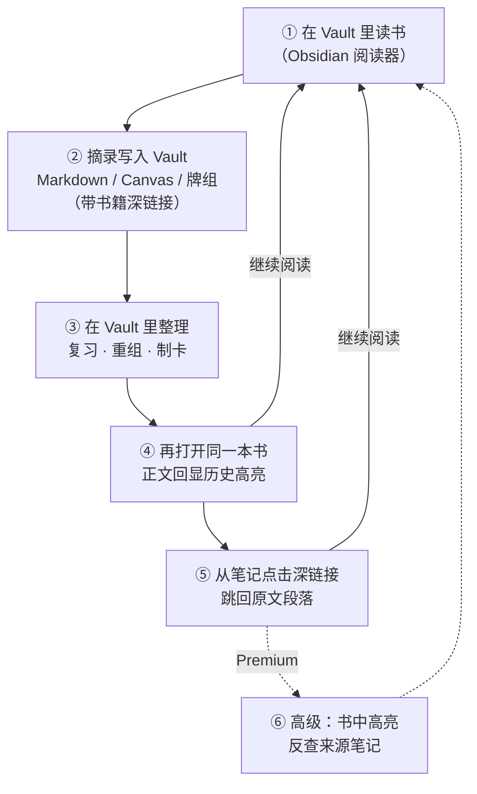
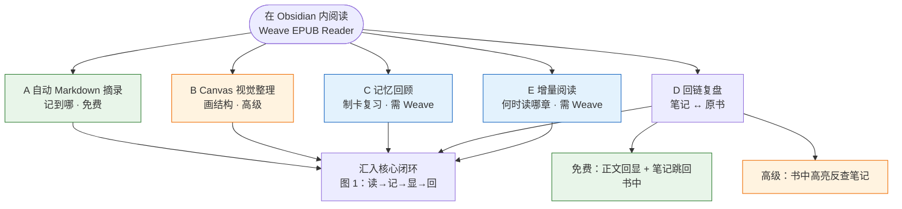

# Weave EPUB Reader

[English README](./README.md)

Weave EPUB Reader 是一款面向 **Obsidian 全平台**（桌面端与移动端）的**多格式电子书阅读器**插件，把「在书里读 → 在笔记里记 → 从笔记回到书里 → 在正文里看见历史摘录」收成一条链路（详见下方 [摘录笔记工作流](#摘录笔记工作流装上之后有什么不同)）。

**无需安装 Weave 主插件**即可独立使用：在 Vault 内打开 EPUB、管理书架、做基础高亮与摘录。安装并启用 [Weave](https://github.com/zhuzhige123/anki-obsidian-plugin) 后，可额外使用制卡、增量阅读、AI 菜单与授权继承等集成能力。

最低 Obsidian 版本：**1.7.0**

## 摘录笔记工作流：装上之后有什么不同

如果你现在的习惯是：**在外部阅读器里读 → 复制段落 → 贴进 Obsidian → 过几天找不到原文**，这款插件要改的是整条链路，而不是「在 Obsidian 里多开一个阅读窗口」。

**阅读发生在 Obsidian 里，摘录天然落在你的 Vault，定位信息跟着摘录一起走。** 下方三张图概括整体结构（GitHub / Obsidian 均可渲染 Mermaid）。

### 图 1 · 核心闭环（装上插件后的主链路）

所有工作流最终都落在这条可反复走的环路上：**读 → 记 → 显 → 回**。

### 图 2 · 五条工作流怎么选（按目标分流）

中心是「在 Obsidian 内读书」；向外是你可能走的五条路径，以及是否需要**高级版**或 **Weave**。

| 图例 | 含义 |
|------|------|
| 绿色路径 | 免费版即可起步 |
| 橙色路径 | 需阅读器**高级版**（或继承 Weave 授权） |
| 蓝色路径 | 需安装并启用 **Weave** 主插件 |

### 图 3 · 增量阅读子流程（工作流 E）

解决「**多本书如何交错推进、长书如何按章深度读**」，与图 1 的「记摘录」互补：**E 管排期，A 管记下什么**。

### 它具体帮你解决什么

| 以前的痛点 | 装上本插件之后 |
|------------|----------------|
| 阅读和笔记是两套工具，来回切换 | 书与笔记同在 Obsidian，可分屏：左笔记、右书籍 |
| 摘录只有文字，没有可靠定位 | 摘录块自带书籍深链接，日后能跳回**同一段** |
| 复习笔记时想不起原文上下文 | 打开书即可在正文看到历史高亮，不用凭记忆找页 |
| 专题研究只能堆长文摘录 | 可绑定 Canvas，摘录落成节点，再回显到正文（高级） |
| 摘录想进入间隔复习 | 可送入 Weave 牌组制卡，牌组摘录同样回显到书中（需 Weave） |
| 同时读多本书容易虎头蛇尾，或长书一次读不完 | 把**当前章节**纳入增量阅读调度，在 **月历视图** 里多书交错、按节奏深度推进（需 Weave） |

### 五条典型工作流

#### A. 自动 Markdown 摘录（最常用，免费核心）

适合「边读边记、笔记就是主战场」：

1. **先**打开一本 Markdown 作为摘录笔记本，光标放在要插入的位置（与阅读器分屏体验最佳）。
2. 打开阅读器，开启工具栏 **自动模式**（闪电图标：开 = 插入，关 = 复制到剪贴板）。
3. 在书中选中文本并摘录 → 带定位的摘录块（含书籍深链接）**自动插入到上一步光标处**。
4. 保存笔记后，再次打开该书，正文会在对应段落**回显高亮**——你在笔记里记过什么，打开书就能看见。

详见 [自动化摘录流程](./docs/user/zh-CN/03-auto-excerpt-workflow.md)。

#### B. Canvas 视觉整理（高级）

适合「做专题、画结构、理清论点关系」：

1. 为当前书**绑定**一个 Canvas 文件。
2. 开启自动模式后，摘录可**自动写入 Canvas 新节点**（可调整节点排布方向）。
3. 在 Canvas 里拖拽、连线、分组；阅读器识别绑定 Canvas 中的摘录并**回显到正文**。

#### C. 记忆回顾（需安装 Weave）

适合「摘录之后要复习、要间隔重复」：

1. 选中文本 → 工具栏 **制卡**，进入 Weave 记忆卡片窗口。
2. 保存到 `.wdeck` 等牌组文件后，阅读器从牌组数据**回显高亮**。
3. 在 Weave 记忆模块中按牌组规则做复习；需要时仍可回到书中原文。

#### D. 回链复盘（免费回显 + 高级双向溯源）

适合「先摘录、后复习、再回原文」：

1. 在 Markdown / Canvas / 牌组笔记里查看历史摘录；打开书时正文侧已有**回显高亮**（免费）。
2. 点击笔记中的书籍深链接 → 跳回**原文段落**。
3. **高级版**：在阅读器里点击某条高亮 → **一键定位到来源笔记**，完成「笔记 ↔ 原书」双向溯源。

#### E. 增量阅读：多书交错与深度精读（需安装 Weave）

适合「**不想一次读完一本**、而是多本书按节奏交错推进，并在月历里看见整体阅读计划」：

> 阅读器提供**增量阅读入口**（不单独占用阅读器高级许可）；**调度、月历视图与任务队列**由 **Weave** 的增量阅读模块提供，需安装并启用 Weave。

1. **把当前章节加入增量阅读**：在阅读器侧边栏 **目录** 中，对某一章使用 **「添加到增量阅读」**（可选择一个增量阅读专题），将该章纳入增量阅读任务。
2. **进入月历视图统一调度**：章节会出现在 Weave **增量阅读月历视图** 中，与来自其他书籍、其他章节的阅读点一起排期——实现 **多本书的交错阅读**，而不是在书架里同时开很多本却都读不深。
3. **深度阅读而非浅尝辄止**：  
   - 选中文本 → 创建 **增量阅读点**（保留 EPUB 溯源深链接），把段落级内容纳入后续处理；  
   - 阅读过程中可标记 **增量阅读续读点**，下次从增量阅读流程**一键回到书中精确位置**继续。  
4. 到调度日时，从月历或任务列表打开对应项 → 经深链接回到原书章节/段落，与摘录、回链工作流衔接。

这与工作流 A（边读边记）互补：**A 解决「记到哪」；E 解决「何时读哪一章、多本书如何轮流推进」**。

### 和「只用外部阅读器 + 手动粘贴」相比

- **少一次上下文切换**：不必为了记一句而离开 Obsidian。
- **摘录可沉淀、可检索**：内容在 Vault 的 Markdown / Canvas / 牌组里，而不是散落在剪贴板历史里。
- **复习时原文仍在场**：笔记是索引，书是现场；两者通过深链接与正文回显连在一起。
- **多端一致**：书与笔记都在 Vault 里，随 Obsidian 同步策略走；手机读、桌面整理可以同一条链路（部分阅读进度等高级能力见上表）。
- **长书与多书有节奏**：章节可进入增量阅读月历，按调度交错阅读，而不是靠意志力硬啃单本。

更完整的操作说明见 [用户手册 · 产品介绍与工作流](./docs/user/zh-CN/00-introduction.md)、[联动与扩展 · 增量阅读](./docs/user/zh-CN/06-integrations.md#weave-主插件可选)。

## 支持的平台与格式

| 平台 | 说明 |
|------|------|
| 桌面端 | Windows、macOS、Linux |
| 移动端 | iOS、Android（`manifest.json` 中 `isDesktopOnly: false`） |

| 格式 | 说明 |
|------|------|
| **EPUB** | 免费版可直接阅读 |
| MOBI、AZW3、FB2、FBZ（`fb2.zip`）、CBZ、TXT | 需**高级版**激活（或继承 Weave 主插件授权） |

插件名称含 EPUB，但**不仅限于 EPUB**；上表以当前版本实际校验为准。

## 核心能力

- **书架与阅读**：Vault 内导入图书、章节目录、分页/连续滚动、字体与主题等版式设置
- **摘录与高亮**：选区标注、插入 Markdown / 复制 / 写入 Canvas（Canvas 写入属高级能力）
- **正文回显**：汇总 Markdown、Canvas、Weave 牌组中的摘录，在书中显示高亮（来源更新后通常数秒内刷新）
- **深链接**：从笔记跳回书中位置；高级版支持阅读器与笔记/Canvas/牌组之间的**双向溯源**
- **扩展**：书签、章节导出、截图、Canvas 绑定；**增量阅读**（目录「添加到增量阅读」、阅读点/续读点 → Weave 月历调度，需 Weave）与 AI 入口

## 免费版与高级版

| 能力 | 免费 | 高级 |
|------|:----:|:----:|
| 阅读 **EPUB**、目录跳转、翻页/滚动、版式与主题 | ✅ | — |
| 阅读 **MOBI / AZW3 / FB2 / FBZ / CBZ / TXT** | — | ✅ |
| 当前页书签 | ✅ | — |
| 基础高亮、批注、摘录与**正文回显** | ✅ | — |
| **阅读进度**持久化、自动保存、书架进度、最后阅读点 | — | ✅ |
| 段落阅读模式、参考阅读点 | — | ✅ |
| 下划线/删除线/波浪线等样式摘录 | — | ✅ |
| **Canvas** 绑定与自动写入节点 | — | ✅ |
| **双向溯源**（阅读器 ↔ 笔记/Canvas/牌组） | — | ✅ |
| 脚注浮窗预览、导出当前章节为 Markdown | — | ✅ |

- **激活**：在阅读器设置中使用 EPUB 独立激活码；若已安装并激活 **Weave 主插件**，可继承授权而无需重复输入。
- **制卡 / 增量阅读 / AI**：不单独占用阅读器高级许可，但需安装 Weave；AI 另需自行配置 API Key。

完整分层以 [功能对照表](./docs/user/zh-CN/00-feature-comparison.md) 为准；激活步骤见 [高级版与激活](./docs/user/zh-CN/08-premium-and-activation.md)，条款见 [PREMIUM_TERMS.md](./PREMIUM_TERMS.md)。

## 安装

### 方式一：社区插件（上架后推荐）

1. 打开 **设置 → 社区插件 → 浏览**
2. 搜索 **Weave EPUB Reader**，安装并启用

### 方式二：手动安装

1. 从 [GitHub Releases](https://github.com/zhuzhige123/obsidian-weave-reader/releases) 下载与 `manifest.json` 版本号一致的发布包，获取：
   - `main.js`
   - `manifest.json`
   - `styles.css`
   - `versions.json`（建议一并复制）
2. 复制到 `.obsidian/plugins/weave-epub-reader/`
3. 重启 Obsidian，在 **设置 → 社区插件** 中启用 **Weave EPUB Reader**

## 快速开始

1. 启用插件后，通过功能区图标或命令面板打开**书架**，从 Vault 导入或打开图书。
2. 在阅读器中选中文本，创建高亮、摘录或书签。
3. 使用工具栏进行章节跳转、显示设置与导出。
4. 阅读器菜单 → **帮助** → **使用教程** 可查看插件内精简教程。工作流细节见上文 [摘录笔记工作流](#摘录笔记工作流装上之后有什么不同)。

## 数据与同步

**建议同步（位于 Vault）**：图书文件、Markdown 摘录、Canvas、Weave 牌组数据。

**通常不需跨设备同步（位于插件目录）**：阅读缓存、索引、部分界面状态。多设备使用时优先同步 Vault 内容，而非直接同步 `.obsidian/plugins/weave-epub-reader/` 下的缓存文件。

## 隐私与网络

- 阅读、渲染、摘录与回链等**默认在本地完成**，不会主动上传 Vault 内容。
- **高级版激活**可能访问许可证服务（激活码、邮箱、设备指纹摘要等），详见 [PRIVACY.md](./PRIVACY.md)。
- **AI 功能**会调用你自行配置的第三方服务。

## 常见问题

### 正文没有显示摘录高亮？

确认摘录由本插件生成、位于 Markdown / Canvas / Weave 牌组文件中，且打开的是**同一本书**。来源文件刚修改时，稍等片刻会自动刷新。

### 非 EPUB 格式打不开？

MOBI、AZW3、FB2 等格式需**高级版**。免费版可直接阅读 EPUB。

### 是否必须安装 Weave？

不必。独立即可阅读 EPUB 并使用基础摘录。制卡、增量阅读、AI 菜单需要 Weave。

### 插件文件夹名称？

插件 ID 为 `weave-epub-reader`，路径：`.obsidian/plugins/weave-epub-reader/`

## 更多文档

- [用户手册（简体中文）](./docs/user/zh-CN/README.md)
- [隐私说明](./PRIVACY.md) · [高级版说明](./PREMIUM_TERMS.md) · [支持](./SUPPORT.md) · [安全](./SECURITY.md)

## 许可证与作者

源码基于 [GPL-3.0-or-later](LICENSE) 发布。基础功能免费、高级功能付费属于产品分层，不改变 GPL 对已发布源码所赋予的权利。

- Author: Rabbit (zhuzhige)
- GitHub: https://github.com/zhuzhige123
